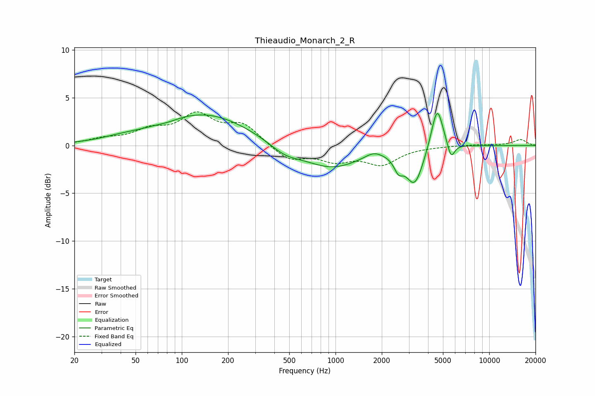

# Thieaudio_Monarch_2_R
See [usage instructions](https://github.com/jaakkopasanen/AutoEq#usage) for more options and info.

### Parametric EQs
Apply preamp of -3.4 dB when using parametric equalizer.

|   # | Type    |   Fc (Hz) |    Q |   Gain (dB) |
|-----|---------|-----------|------|-------------|
|   1 | Peaking |        40 | 1.12 |         0.3 |
|   2 | Peaking |        82 | 2.07 |        -0.2 |
|   3 | Peaking |       139 | 0.48 |         3.3 |
|   4 | Peaking |       466 | 1.39 |        -1   |
|   5 | Peaking |       940 | 0.75 |        -2.3 |
|   6 | Peaking |      1771 | 2.6  |         0.6 |
|   7 | Peaking |      2568 | 4.93 |        -1.4 |
|   8 | Peaking |      3273 | 2.49 |        -3.9 |
|   9 | Peaking |      4584 | 3.66 |         4.7 |
|  10 | Peaking |      5644 | 5.88 |        -1.7 |

### Fixed Band EQs
When using fixed band (also called graphic) equalizer, apply preamp of **-3.6 dB** (if available) and set gains manually with these parameters.

|   # | Type    |   Fc (Hz) |    Q |   Gain (dB) |
|-----|---------|-----------|------|-------------|
|   1 | Peaking |        31 | 1.41 |         0.6 |
|   2 | Peaking |        62 | 1.41 |         1.4 |
|   3 | Peaking |       125 | 1.41 |         2.9 |
|   4 | Peaking |       250 | 1.41 |         2.1 |
|   5 | Peaking |       500 | 1.41 |        -1.5 |
|   6 | Peaking |      1000 | 1.41 |        -1.4 |
|   7 | Peaking |      2000 | 1.41 |        -1.8 |
|   8 | Peaking |      4000 | 1.41 |        -0.1 |
|   9 | Peaking |      8000 | 1.41 |         0.1 |
|  10 | Peaking |     16000 | 1.41 |         0.6 |

### Graphs

