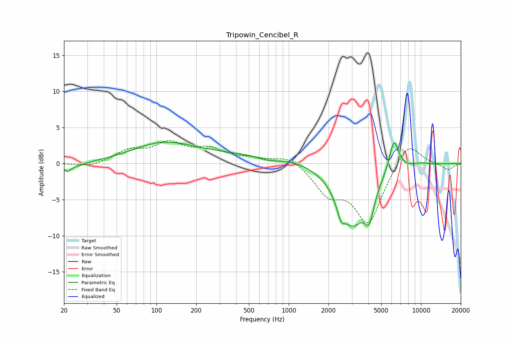

# Tripowin_Cencibel_R
See [usage instructions](https://github.com/jaakkopasanen/AutoEq#usage) for more options and info.

### Parametric EQs
Apply preamp of -3.1 dB when using parametric equalizer.

|   # | Type    |   Fc (Hz) |    Q |   Gain (dB) |
|-----|---------|-----------|------|-------------|
|   1 | Peaking |        21 | 5.95 |        -0.8 |
|   2 | Peaking |        24 | 1.64 |        -0.6 |
|   3 | Peaking |       109 | 0.63 |         2.3 |
|   4 | Peaking |       619 | 0.18 |         1.3 |
|   5 | Peaking |       708 | 1.58 |        -0.6 |
|   6 | Peaking |      2478 | 5.32 |        -1.9 |
|   7 | Peaking |      3024 | 1.19 |        -8.7 |
|   8 | Peaking |      4072 | 4.14 |        -3.7 |
|   9 | Peaking |      6250 | 3.75 |         4.6 |
|  10 | Peaking |     10000 | 2.06 |         0.3 |

### Fixed Band EQs
When using fixed band (also called graphic) equalizer, apply preamp of **-3.3 dB** (if available) and set gains manually with these parameters.

|   # | Type    |   Fc (Hz) |    Q |   Gain (dB) |
|-----|---------|-----------|------|-------------|
|   1 | Peaking |        31 | 1.41 |        -0.5 |
|   2 | Peaking |        62 | 1.41 |         1.7 |
|   3 | Peaking |       125 | 1.41 |         2.6 |
|   4 | Peaking |       250 | 1.41 |         1.8 |
|   5 | Peaking |       500 | 1.41 |         0.6 |
|   6 | Peaking |      1000 | 1.41 |         1.2 |
|   7 | Peaking |      2000 | 1.41 |        -3.7 |
|   8 | Peaking |      4000 | 1.41 |        -8.1 |
|   9 | Peaking |      8000 | 1.41 |         3.4 |
|  10 | Peaking |     16000 | 1.41 |        -0.9 |

### Graphs

