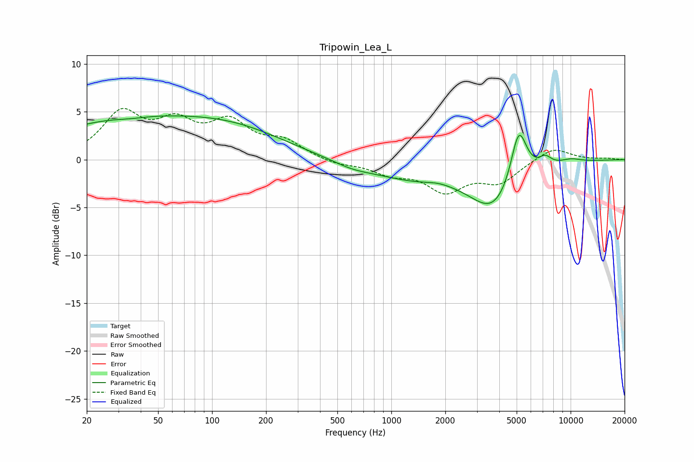

# Tripowin_Lea_L
See [usage instructions](https://github.com/jaakkopasanen/AutoEq#usage) for more options and info.

### Parametric EQs
Apply preamp of -4.7 dB when using parametric equalizer.

|   # | Type    |   Fc (Hz) |    Q |   Gain (dB) |
|-----|---------|-----------|------|-------------|
|   1 | Peaking |        33 | 0.32 |         4   |
|   2 | Peaking |        35 | 1.56 |        -0.2 |
|   3 | Peaking |       142 | 0.5  |         2.3 |
|   4 | Peaking |       602 | 1.29 |        -0.5 |
|   5 | Peaking |      1340 | 0.56 |        -1.8 |
|   6 | Peaking |      1823 | 1.98 |         0.3 |
|   7 | Peaking |      3753 | 1.05 |        -4.9 |
|   8 | Peaking |      5133 | 3.04 |         5.9 |
|   9 | Peaking |      7211 | 3.88 |         1   |
|  10 | Peaking |     10000 | 2.1  |         0.4 |

### Fixed Band EQs
When using fixed band (also called graphic) equalizer, apply preamp of **-5.5 dB** (if available) and set gains manually with these parameters.

|   # | Type    |   Fc (Hz) |    Q |   Gain (dB) |
|-----|---------|-----------|------|-------------|
|   1 | Peaking |        31 | 1.41 |         4.6 |
|   2 | Peaking |        62 | 1.41 |         3.3 |
|   3 | Peaking |       125 | 1.41 |         3.5 |
|   4 | Peaking |       250 | 1.41 |         1.7 |
|   5 | Peaking |       500 | 1.41 |        -0.5 |
|   6 | Peaking |      1000 | 1.41 |        -1.3 |
|   7 | Peaking |      2000 | 1.41 |        -3   |
|   8 | Peaking |      4000 | 1.41 |        -2.2 |
|   9 | Peaking |      8000 | 1.41 |         1.4 |
|  10 | Peaking |     16000 | 1.41 |         0.1 |

### Graphs

