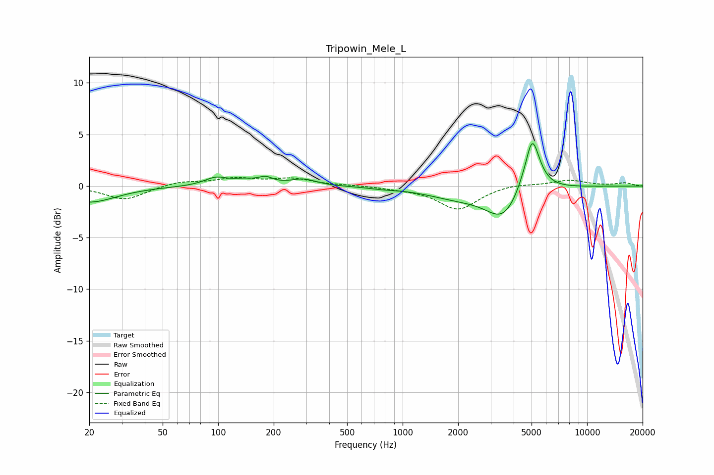

# Tripowin_Mele_L
See [usage instructions](https://github.com/jaakkopasanen/AutoEq#usage) for more options and info.

### Parametric EQs
Apply preamp of -4.2 dB when using parametric equalizer.

|   # | Type    |   Fc (Hz) |    Q |   Gain (dB) |
|-----|---------|-----------|------|-------------|
|   1 | Peaking |        20 | 0.98 |        -1.6 |
|   2 | Peaking |        97 | 2.23 |         0.8 |
|   3 | Peaking |       138 | 2.37 |         0.4 |
|   4 | Peaking |       180 | 3.46 |         0.6 |
|   5 | Peaking |       289 | 2.06 |         0.6 |
|   6 | Peaking |       778 | 2.08 |        -0.1 |
|   7 | Peaking |      1992 | 0.82 |        -1   |
|   8 | Peaking |      3514 | 1.52 |        -2.9 |
|   9 | Peaking |      4740 | 6    |        -0.6 |
|  10 | Peaking |      4994 | 3.25 |         5.9 |

### Fixed Band EQs
When using fixed band (also called graphic) equalizer, apply preamp of **-0.9 dB** (if available) and set gains manually with these parameters.

|   # | Type    |   Fc (Hz) |    Q |   Gain (dB) |
|-----|---------|-----------|------|-------------|
|   1 | Peaking |        31 | 1.41 |        -1.3 |
|   2 | Peaking |        62 | 1.41 |         0.4 |
|   3 | Peaking |       125 | 1.41 |         0.7 |
|   4 | Peaking |       250 | 1.41 |         0.7 |
|   5 | Peaking |       500 | 1.41 |         0.1 |
|   6 | Peaking |      1000 | 1.41 |        -0.2 |
|   7 | Peaking |      2000 | 1.41 |        -2.3 |
|   8 | Peaking |      4000 | 1.41 |         0.3 |
|   9 | Peaking |      8000 | 1.41 |         0.6 |
|  10 | Peaking |     16000 | 1.41 |         0.3 |

### Graphs

