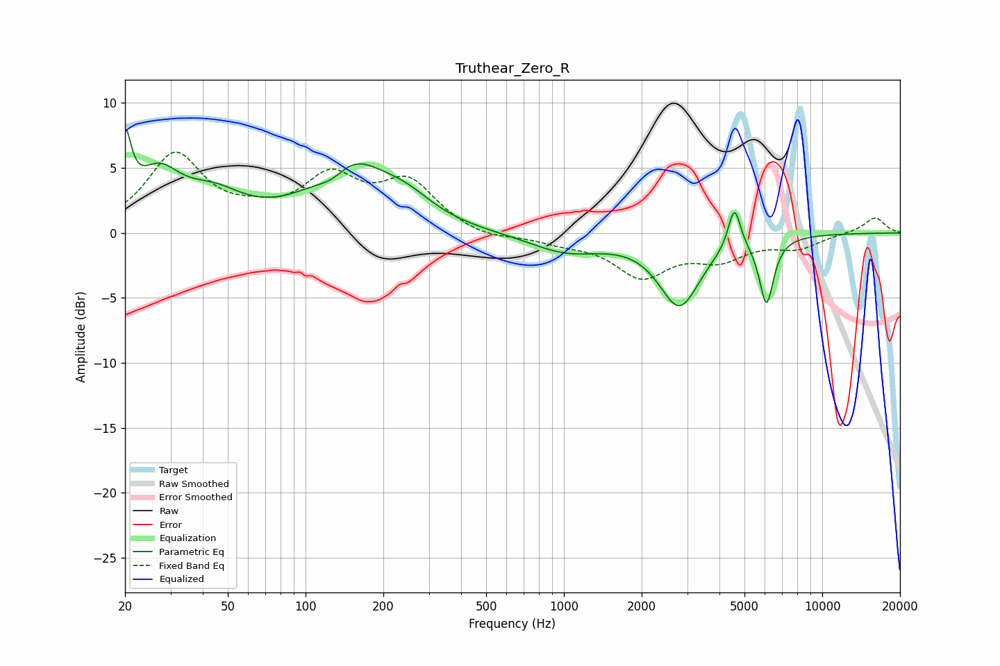

# Truthear_Zero_R
See [usage instructions](https://github.com/jaakkopasanen/AutoEq#usage) for more options and info.

### Parametric EQs
Apply preamp of -8.1 dB when using parametric equalizer.

|   # | Type    |   Fc (Hz) |    Q |   Gain (dB) |
|-----|---------|-----------|------|-------------|
|   1 | Peaking |        20 | 5.97 |         5.5 |
|   2 | Peaking |        27 | 1.65 |         3.8 |
|   3 | Peaking |        44 | 1.19 |         2.3 |
|   4 | Peaking |       127 | 2.18 |        -1.4 |
|   5 | Peaking |       146 | 0.99 |         5.4 |
|   6 | Peaking |       245 | 1.33 |         1.5 |
|   7 | Peaking |      1023 | 0.99 |        -1.4 |
|   8 | Peaking |      2801 | 1.79 |        -5.4 |
|   9 | Peaking |      4570 | 5.8  |         3.3 |
|  10 | Peaking |      6085 | 4.97 |        -5.1 |

### Fixed Band EQs
When using fixed band (also called graphic) equalizer, apply preamp of **-6.3 dB** (if available) and set gains manually with these parameters.

|   # | Type    |   Fc (Hz) |    Q |   Gain (dB) |
|-----|---------|-----------|------|-------------|
|   1 | Peaking |        31 | 1.41 |         5.9 |
|   2 | Peaking |        62 | 1.41 |         0.9 |
|   3 | Peaking |       125 | 1.41 |         3.9 |
|   4 | Peaking |       250 | 1.41 |         3.7 |
|   5 | Peaking |       500 | 1.41 |        -0.6 |
|   6 | Peaking |      1000 | 1.41 |        -0.6 |
|   7 | Peaking |      2000 | 1.41 |        -3.2 |
|   8 | Peaking |      4000 | 1.41 |        -1.7 |
|   9 | Peaking |      8000 | 1.41 |        -1   |
|  10 | Peaking |     16000 | 1.41 |         1.2 |

### Graphs

