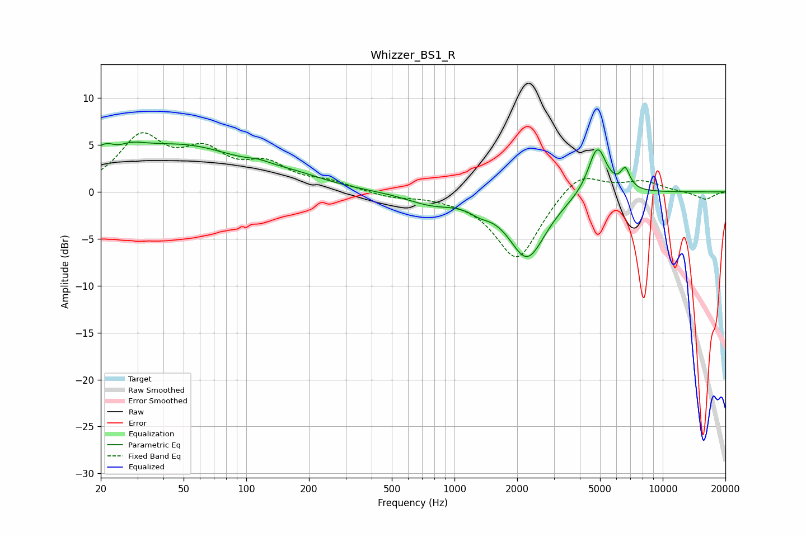

# Whizzer_BS1_R
See [usage instructions](https://github.com/jaakkopasanen/AutoEq#usage) for more options and info.

### Parametric EQs
Apply preamp of -5.4 dB when using parametric equalizer.

|   # | Type    |   Fc (Hz) |    Q |   Gain (dB) |
|-----|---------|-----------|------|-------------|
|   1 | Peaking |        23 | 1.45 |         5.1 |
|   2 | Peaking |        24 | 2.56 |        -2.4 |
|   3 | Peaking |        52 | 0.53 |         4.3 |
|   4 | Peaking |       115 | 2.62 |         0.4 |
|   5 | Peaking |       166 | 0.88 |         1   |
|   6 | Peaking |       775 | 1.17 |        -1.1 |
|   7 | Peaking |      1323 | 2.76 |        -0.8 |
|   8 | Peaking |      2234 | 1.58 |        -6.9 |
|   9 | Peaking |      4853 | 3.16 |         5.2 |
|  10 | Peaking |      6609 | 6    |         2.1 |

### Fixed Band EQs
When using fixed band (also called graphic) equalizer, apply preamp of **-6.4 dB** (if available) and set gains manually with these parameters.

|   # | Type    |   Fc (Hz) |    Q |   Gain (dB) |
|-----|---------|-----------|------|-------------|
|   1 | Peaking |        31 | 1.41 |         5.5 |
|   2 | Peaking |        62 | 1.41 |         3.6 |
|   3 | Peaking |       125 | 1.41 |         2.5 |
|   4 | Peaking |       250 | 1.41 |         0.9 |
|   5 | Peaking |       500 | 1.41 |        -0.6 |
|   6 | Peaking |      1000 | 1.41 |        -0.3 |
|   7 | Peaking |      2000 | 1.41 |        -7.3 |
|   8 | Peaking |      4000 | 1.41 |         2.4 |
|   9 | Peaking |      8000 | 1.41 |         1.1 |
|  10 | Peaking |     16000 | 1.41 |        -0.8 |

### Graphs

