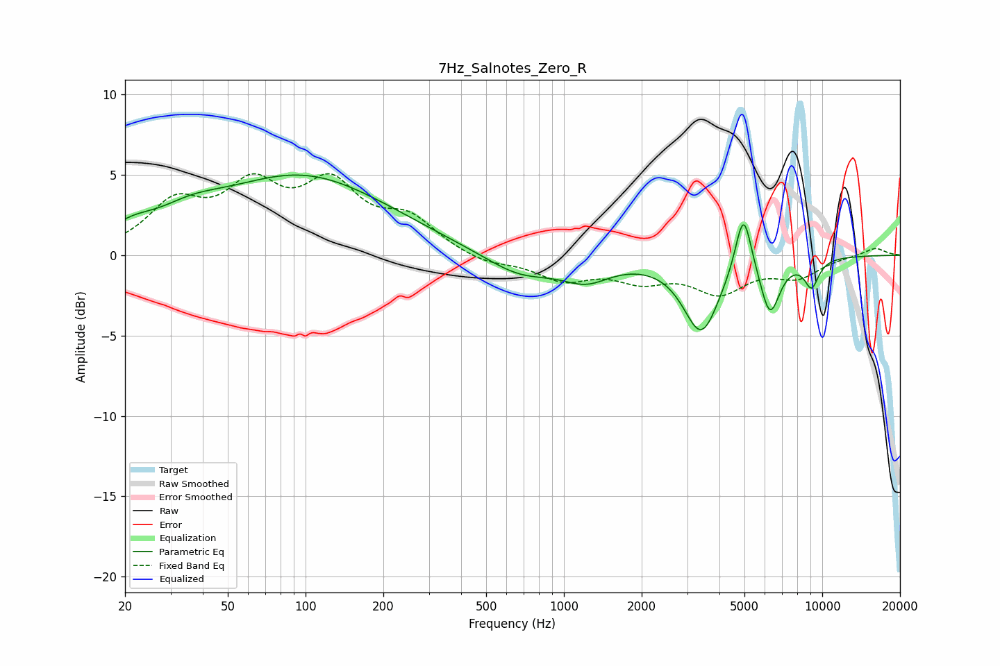

# 7Hz_Salnotes_Zero_R
See [usage instructions](https://github.com/jaakkopasanen/AutoEq#usage) for more options and info.

### Parametric EQs
Apply preamp of -5.1 dB when using parametric equalizer.

|   # | Type    |   Fc (Hz) |    Q |   Gain (dB) |
|-----|---------|-----------|------|-------------|
|   1 | Peaking |        21 | 1.62 |         0.9 |
|   2 | Peaking |        36 | 1.1  |         1.1 |
|   3 | Peaking |        97 | 0.43 |         4.8 |
|   4 | Peaking |       236 | 1.02 |         0.1 |
|   5 | Peaking |       674 | 1.04 |        -1.4 |
|   6 | Peaking |      1220 | 1.48 |        -1.3 |
|   7 | Peaking |      3404 | 2.03 |        -4.7 |
|   8 | Peaking |      4955 | 4.42 |         4   |
|   9 | Peaking |      6276 | 3.61 |        -3.4 |
|  10 | Peaking |      9098 | 4.54 |        -1.7 |

### Fixed Band EQs
When using fixed band (also called graphic) equalizer, apply preamp of **-5.2 dB** (if available) and set gains manually with these parameters.

|   # | Type    |   Fc (Hz) |    Q |   Gain (dB) |
|-----|---------|-----------|------|-------------|
|   1 | Peaking |        31 | 1.41 |         2.9 |
|   2 | Peaking |        62 | 1.41 |         3.7 |
|   3 | Peaking |       125 | 1.41 |         3.9 |
|   4 | Peaking |       250 | 1.41 |         2   |
|   5 | Peaking |       500 | 1.41 |        -0.6 |
|   6 | Peaking |      1000 | 1.41 |        -1.4 |
|   7 | Peaking |      2000 | 1.41 |        -1.3 |
|   8 | Peaking |      4000 | 1.41 |        -2.1 |
|   9 | Peaking |      8000 | 1.41 |        -1.2 |
|  10 | Peaking |     16000 | 1.41 |         0.5 |

### Graphs

