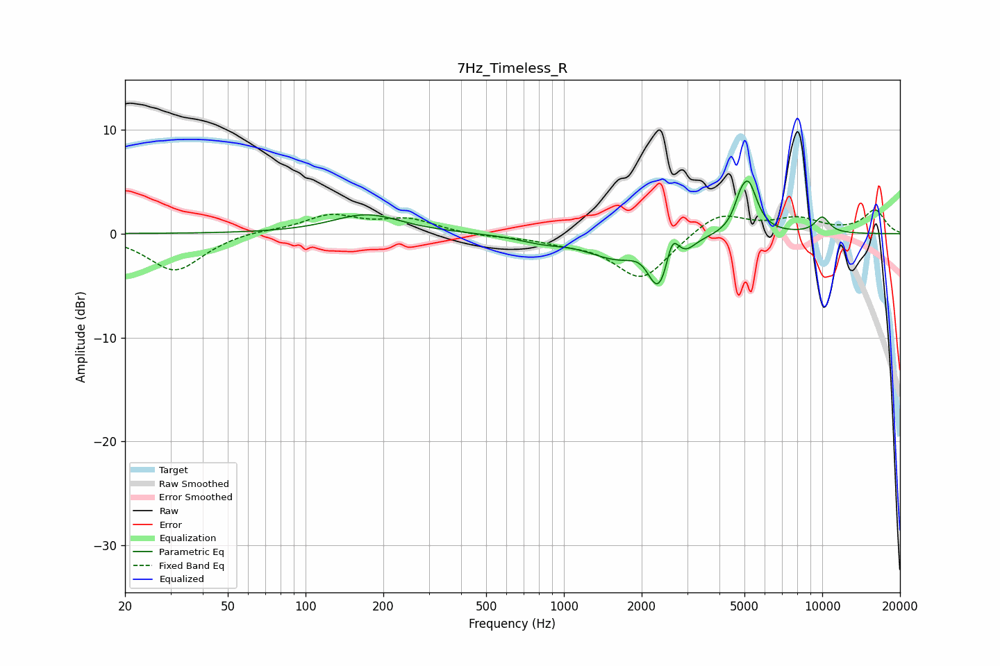

# 7Hz_Timeless_R
See [usage instructions](https://github.com/jaakkopasanen/AutoEq#usage) for more options and info.

### Parametric EQs
Apply preamp of -5.2 dB when using parametric equalizer.

|   # | Type    |   Fc (Hz) |    Q |   Gain (dB) |
|-----|---------|-----------|------|-------------|
|   1 | Peaking |       172 | 1.07 |         1.8 |
|   2 | Peaking |       825 | 1.54 |        -0.6 |
|   3 | Peaking |      1583 | 1.24 |        -2   |
|   4 | Peaking |      1999 | 3.35 |         0.7 |
|   5 | Peaking |      2333 | 3.17 |        -4.9 |
|   6 | Peaking |      2624 | 6    |         2.6 |
|   7 | Peaking |      2985 | 4.65 |        -0.6 |
|   8 | Peaking |      4798 | 5.96 |         1.2 |
|   9 | Peaking |      5178 | 4.02 |         4.6 |
|  10 | Peaking |     10000 | 4.19 |         1.5 |

### Fixed Band EQs
When using fixed band (also called graphic) equalizer, apply preamp of **-2.4 dB** (if available) and set gains manually with these parameters.

|   # | Type    |   Fc (Hz) |    Q |   Gain (dB) |
|-----|---------|-----------|------|-------------|
|   1 | Peaking |        31 | 1.41 |        -3.6 |
|   2 | Peaking |        62 | 1.41 |         0.3 |
|   3 | Peaking |       125 | 1.41 |         1.7 |
|   4 | Peaking |       250 | 1.41 |         1.3 |
|   5 | Peaking |       500 | 1.41 |        -0.3 |
|   6 | Peaking |      1000 | 1.41 |        -0.6 |
|   7 | Peaking |      2000 | 1.41 |        -4.4 |
|   8 | Peaking |      4000 | 1.41 |         2.2 |
|   9 | Peaking |      8000 | 1.41 |         1.3 |
|  10 | Peaking |     16000 | 1.41 |         2.2 |

### Graphs

