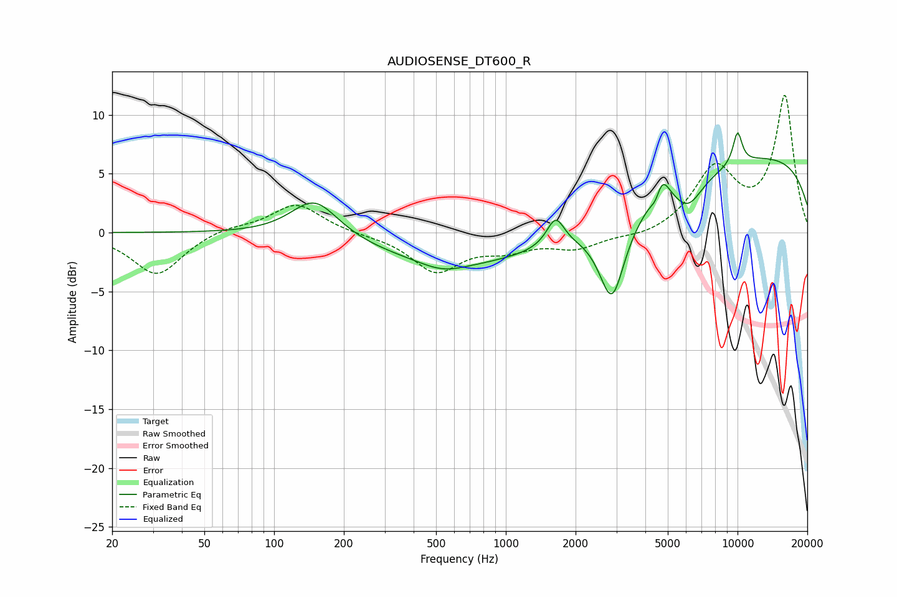

# AUDIOSENSE_DT600_R
See [usage instructions](https://github.com/jaakkopasanen/AutoEq#usage) for more options and info.

### Parametric EQs
Apply preamp of -8.6 dB when using parametric equalizer.

|   # | Type    |   Fc (Hz) |    Q |   Gain (dB) |
|-----|---------|-----------|------|-------------|
|   1 | Peaking |       150 | 1.39 |         3.3 |
|   2 | Peaking |       536 | 1.42 |        -0.8 |
|   3 | Peaking |      1482 | 0.18 |        -3.4 |
|   4 | Peaking |      1640 | 3.73 |         2.4 |
|   5 | Peaking |      2871 | 2.54 |        -6.9 |
|   6 | Peaking |      4463 | 5.79 |        -1.7 |
|   7 | Peaking |      4640 | 3.93 |         3.2 |
|   8 | Peaking |      6129 | 2.25 |        -2.2 |
|   9 | Peaking |      9773 | 0.18 |         7.1 |
|  10 | Peaking |     10000 | 6    |         2.8 |

### Fixed Band EQs
When using fixed band (also called graphic) equalizer, apply preamp of **-11.7 dB** (if available) and set gains manually with these parameters.

|   # | Type    |   Fc (Hz) |    Q |   Gain (dB) |
|-----|---------|-----------|------|-------------|
|   1 | Peaking |        31 | 1.41 |        -3.6 |
|   2 | Peaking |        62 | 1.41 |         0.5 |
|   3 | Peaking |       125 | 1.41 |         2.5 |
|   4 | Peaking |       250 | 1.41 |        -0.1 |
|   5 | Peaking |       500 | 1.41 |        -3.2 |
|   6 | Peaking |      1000 | 1.41 |        -1.2 |
|   7 | Peaking |      2000 | 1.41 |        -1.2 |
|   8 | Peaking |      4000 | 1.41 |        -0.5 |
|   9 | Peaking |      8000 | 1.41 |         5.3 |
|  10 | Peaking |     16000 | 1.41 |        11.5 |

### Graphs

