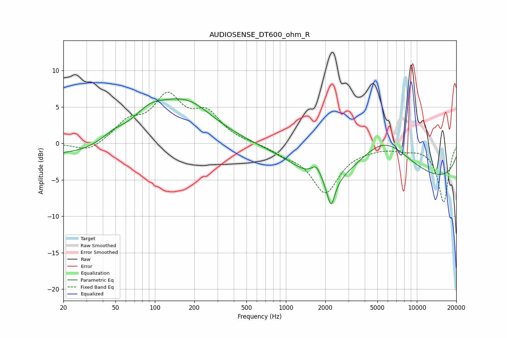

# AUDIOSENSE_DT600_ohm_R
See [usage instructions](https://github.com/jaakkopasanen/AutoEq#usage) for more options and info.

### Parametric EQs
Apply preamp of -6.2 dB when using parametric equalizer.

|   # | Type    |   Fc (Hz) |    Q |   Gain (dB) |
|-----|---------|-----------|------|-------------|
|   1 | Peaking |        23 | 0.18 |        -1.8 |
|   2 | Peaking |        49 | 1.39 |         1.4 |
|   3 | Peaking |        90 | 1.05 |         3.3 |
|   4 | Peaking |       173 | 0.66 |         5.6 |
|   5 | Peaking |      1709 | 3.61 |         1.9 |
|   6 | Peaking |      1973 | 0.62 |        -3.9 |
|   7 | Peaking |      2209 | 4.79 |        -6.7 |
|   8 | Peaking |      2210 | 5.16 |         2.7 |
|   9 | Peaking |      5544 | 0.66 |         5.7 |
|  10 | Peaking |     10000 | 0.18 |        -5.3 |

### Fixed Band EQs
When using fixed band (also called graphic) equalizer, apply preamp of **-7.1 dB** (if available) and set gains manually with these parameters.

|   # | Type    |   Fc (Hz) |    Q |   Gain (dB) |
|-----|---------|-----------|------|-------------|
|   1 | Peaking |        31 | 1.41 |        -1.3 |
|   2 | Peaking |        62 | 1.41 |         2.6 |
|   3 | Peaking |       125 | 1.41 |         5.9 |
|   4 | Peaking |       250 | 1.41 |         3.7 |
|   5 | Peaking |       500 | 1.41 |         0.1 |
|   6 | Peaking |      1000 | 1.41 |        -1   |
|   7 | Peaking |      2000 | 1.41 |        -6.5 |
|   8 | Peaking |      4000 | 1.41 |        -0.4 |
|   9 | Peaking |      8000 | 1.41 |        -0.6 |
|  10 | Peaking |     16000 | 1.41 |        -8   |

### Graphs

