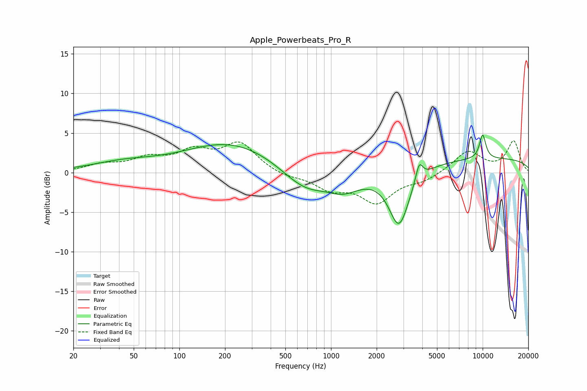

# Apple_Powerbeats_Pro_R
See [usage instructions](https://github.com/jaakkopasanen/AutoEq#usage) for more options and info.

### Parametric EQs
Apply preamp of -4.9 dB when using parametric equalizer.

|   # | Type    |   Fc (Hz) |    Q |   Gain (dB) |
|-----|---------|-----------|------|-------------|
|   1 | Peaking |        43 | 0.65 |         1.1 |
|   2 | Peaking |       218 | 0.46 |         3.7 |
|   3 | Peaking |       607 | 1    |        -1.7 |
|   4 | Peaking |       731 | 1.36 |        -0.8 |
|   5 | Peaking |      1018 | 1.42 |         0.7 |
|   6 | Peaking |      1143 | 1.13 |        -3.1 |
|   7 | Peaking |      2810 | 2.07 |        -7.3 |
|   8 | Peaking |      3815 | 6    |         2.3 |
|   9 | Peaking |     10000 | 5.72 |         3.1 |
|  10 | Peaking |     10000 | 0.18 |         1.8 |

### Fixed Band EQs
When using fixed band (also called graphic) equalizer, apply preamp of **-4.1 dB** (if available) and set gains manually with these parameters.

|   # | Type    |   Fc (Hz) |    Q |   Gain (dB) |
|-----|---------|-----------|------|-------------|
|   1 | Peaking |        31 | 1.41 |         0.9 |
|   2 | Peaking |        62 | 1.41 |         1.6 |
|   3 | Peaking |       125 | 1.41 |         2.4 |
|   4 | Peaking |       250 | 1.41 |         3.5 |
|   5 | Peaking |       500 | 1.41 |        -0.5 |
|   6 | Peaking |      1000 | 1.41 |        -1.9 |
|   7 | Peaking |      2000 | 1.41 |        -3.6 |
|   8 | Peaking |      4000 | 1.41 |        -0.9 |
|   9 | Peaking |      8000 | 1.41 |         2.7 |
|  10 | Peaking |     16000 | 1.41 |         3.9 |

### Graphs

