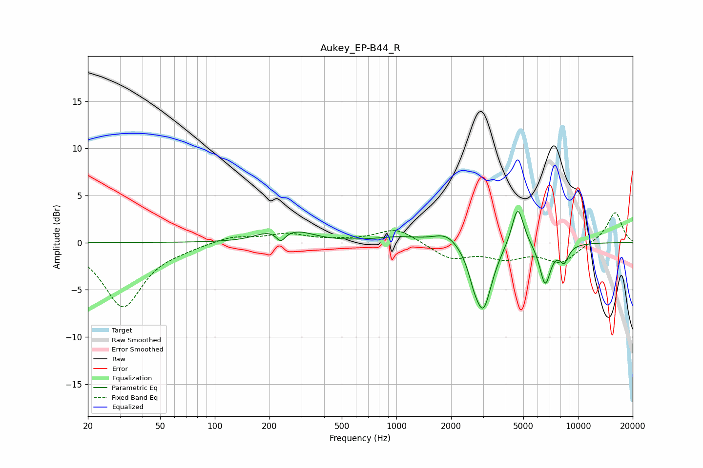

# Aukey_EP-B44_R
See [usage instructions](https://github.com/jaakkopasanen/AutoEq#usage) for more options and info.

### Parametric EQs
Apply preamp of -3.4 dB when using parametric equalizer.

|   # | Type    |   Fc (Hz) |    Q |   Gain (dB) |
|-----|---------|-----------|------|-------------|
|   1 | Peaking |       196 | 1.84 |         0.7 |
|   2 | Peaking |       231 | 5.94 |        -1   |
|   3 | Peaking |       286 | 1.49 |         1   |
|   4 | Peaking |      1034 | 1.09 |         0.6 |
|   5 | Peaking |      1894 | 2.01 |         1.2 |
|   6 | Peaking |      2661 | 4.74 |        -1.3 |
|   7 | Peaking |      3006 | 2.96 |        -6.9 |
|   8 | Peaking |      4655 | 4.2  |         4.4 |
|   9 | Peaking |      6592 | 4.51 |        -4.3 |
|  10 | Peaking |      8384 | 5.1  |        -1.7 |

### Fixed Band EQs
When using fixed band (also called graphic) equalizer, apply preamp of **-3.3 dB** (if available) and set gains manually with these parameters.

|   # | Type    |   Fc (Hz) |    Q |   Gain (dB) |
|-----|---------|-----------|------|-------------|
|   1 | Peaking |        31 | 1.41 |        -6.8 |
|   2 | Peaking |        62 | 1.41 |        -0.4 |
|   3 | Peaking |       125 | 1.41 |         0.7 |
|   4 | Peaking |       250 | 1.41 |         0.9 |
|   5 | Peaking |       500 | 1.41 |         0.2 |
|   6 | Peaking |      1000 | 1.41 |         1.5 |
|   7 | Peaking |      2000 | 1.41 |        -1.7 |
|   8 | Peaking |      4000 | 1.41 |        -1.4 |
|   9 | Peaking |      8000 | 1.41 |        -2   |
|  10 | Peaking |     16000 | 1.41 |         3.3 |

### Graphs

