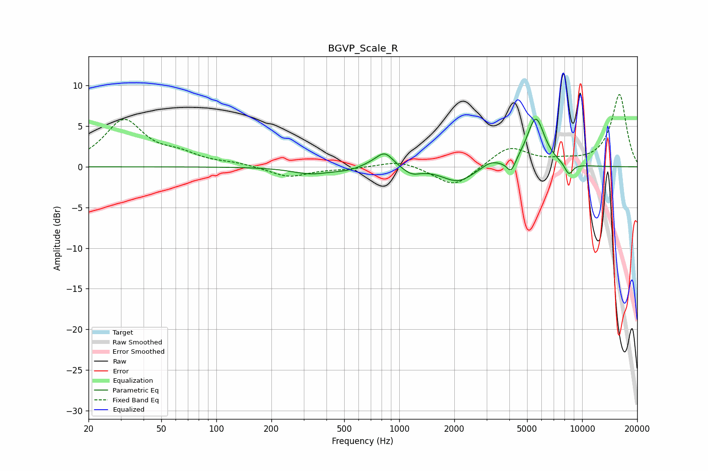

# BGVP_Scale_R
See [usage instructions](https://github.com/jaakkopasanen/AutoEq#usage) for more options and info.

### Parametric EQs
Apply preamp of -5.9 dB when using parametric equalizer.

|   # | Type    |   Fc (Hz) |    Q |   Gain (dB) |
|-----|---------|-----------|------|-------------|
|   1 | Peaking |       330 | 1.36 |        -0.8 |
|   2 | Peaking |       524 | 1.94 |        -0.3 |
|   3 | Peaking |       720 | 2.06 |         0.4 |
|   4 | Peaking |       835 | 3.05 |         1.8 |
|   5 | Peaking |      1166 | 2.96 |        -0.8 |
|   6 | Peaking |      2093 | 1.63 |        -1.9 |
|   7 | Peaking |      3156 | 2.78 |         0.8 |
|   8 | Peaking |      4091 | 6    |        -1.6 |
|   9 | Peaking |      5578 | 2.83 |         6.1 |
|  10 | Peaking |      8453 | 5.67 |        -1.4 |

### Fixed Band EQs
When using fixed band (also called graphic) equalizer, apply preamp of **-9.0 dB** (if available) and set gains manually with these parameters.

|   # | Type    |   Fc (Hz) |    Q |   Gain (dB) |
|-----|---------|-----------|------|-------------|
|   1 | Peaking |        31 | 1.41 |         5.6 |
|   2 | Peaking |        62 | 1.41 |         1.2 |
|   3 | Peaking |       125 | 1.41 |         0.4 |
|   4 | Peaking |       250 | 1.41 |        -1.3 |
|   5 | Peaking |       500 | 1.41 |        -0.2 |
|   6 | Peaking |      1000 | 1.41 |         0.8 |
|   7 | Peaking |      2000 | 1.41 |        -2.6 |
|   8 | Peaking |      4000 | 1.41 |         2.5 |
|   9 | Peaking |      8000 | 1.41 |         0.5 |
|  10 | Peaking |     16000 | 1.41 |         8.9 |

### Graphs

