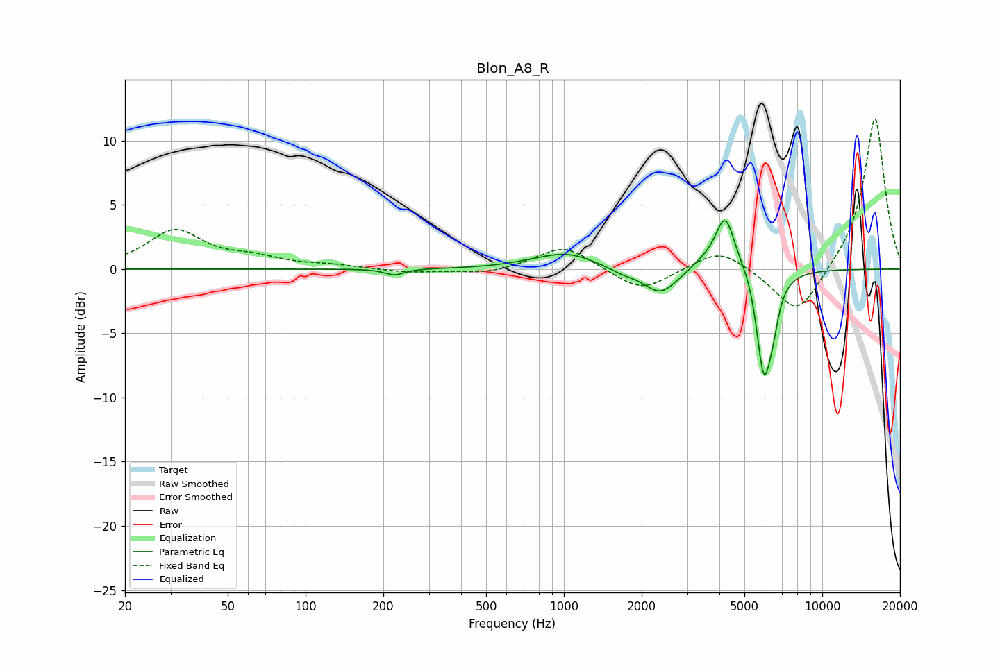

# Blon_A8_R
See [usage instructions](https://github.com/jaakkopasanen/AutoEq#usage) for more options and info.

### Parametric EQs
Apply preamp of -3.9 dB when using parametric equalizer.

|   # | Type    |   Fc (Hz) |    Q |   Gain (dB) |
|-----|---------|-----------|------|-------------|
|   1 | Peaking |       221 | 3.79 |        -0.5 |
|   2 | Peaking |       761 | 1.42 |         0.2 |
|   3 | Peaking |      1038 | 1.32 |         1.1 |
|   4 | Peaking |      1689 | 2.82 |        -0.3 |
|   5 | Peaking |      2365 | 2.16 |        -2   |
|   6 | Peaking |      3478 | 2.62 |         0.5 |
|   7 | Peaking |      4212 | 3.65 |         4.3 |
|   8 | Peaking |      5207 | 4.11 |         0.6 |
|   9 | Peaking |      5942 | 4.68 |        -8.1 |
|  10 | Peaking |      6453 | 6    |        -1.9 |

### Fixed Band EQs
When using fixed band (also called graphic) equalizer, apply preamp of **-11.8 dB** (if available) and set gains manually with these parameters.

|   # | Type    |   Fc (Hz) |    Q |   Gain (dB) |
|-----|---------|-----------|------|-------------|
|   1 | Peaking |        31 | 1.41 |         2.9 |
|   2 | Peaking |        62 | 1.41 |         0.7 |
|   3 | Peaking |       125 | 1.41 |         0.2 |
|   4 | Peaking |       250 | 1.41 |        -0.3 |
|   5 | Peaking |       500 | 1.41 |        -0.4 |
|   6 | Peaking |      1000 | 1.41 |         1.9 |
|   7 | Peaking |      2000 | 1.41 |        -1.8 |
|   8 | Peaking |      4000 | 1.41 |         1.7 |
|   9 | Peaking |      8000 | 1.41 |        -3.8 |
|  10 | Peaking |     16000 | 1.41 |        11.9 |

### Graphs

