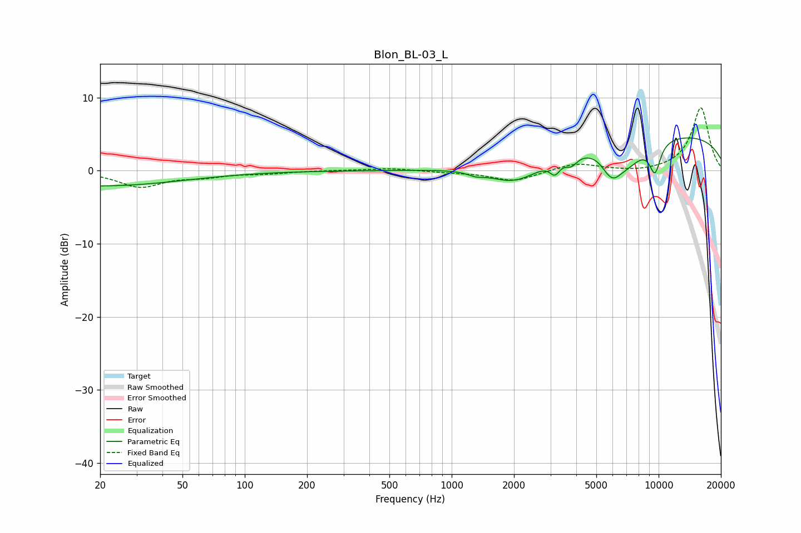

# Blon_BL-03_L
See [usage instructions](https://github.com/jaakkopasanen/AutoEq#usage) for more options and info.

### Parametric EQs
Apply preamp of -4.6 dB when using parametric equalizer.

|   # | Type    |   Fc (Hz) |    Q |   Gain (dB) |
|-----|---------|-----------|------|-------------|
|   1 | Peaking |        20 | 0.35 |        -2.1 |
|   2 | Peaking |      1305 | 4.05 |        -0.4 |
|   3 | Peaking |      2045 | 1.04 |        -3.6 |
|   4 | Peaking |      3154 | 5.74 |        -1.7 |
|   5 | Peaking |      3786 | 4.79 |        -1.3 |
|   6 | Peaking |      5711 | 3.55 |        -1.5 |
|   7 | Peaking |      6108 | 3.9  |        -1.3 |
|   8 | Peaking |      6874 | 1.58 |        -3.5 |
|   9 | Peaking |      9604 | 4.62 |        -4   |
|  10 | Peaking |      9620 | 0.18 |         5.2 |

### Fixed Band EQs
When using fixed band (also called graphic) equalizer, apply preamp of **-8.7 dB** (if available) and set gains manually with these parameters.

|   # | Type    |   Fc (Hz) |    Q |   Gain (dB) |
|-----|---------|-----------|------|-------------|
|   1 | Peaking |        31 | 1.41 |        -2.1 |
|   2 | Peaking |        62 | 1.41 |        -0.7 |
|   3 | Peaking |       125 | 1.41 |        -0.3 |
|   4 | Peaking |       250 | 1.41 |         0   |
|   5 | Peaking |       500 | 1.41 |         0.3 |
|   6 | Peaking |      1000 | 1.41 |        -0.2 |
|   7 | Peaking |      2000 | 1.41 |        -1.4 |
|   8 | Peaking |      4000 | 1.41 |         1.1 |
|   9 | Peaking |      8000 | 1.41 |        -0.3 |
|  10 | Peaking |     16000 | 1.41 |         8.7 |

### Graphs

