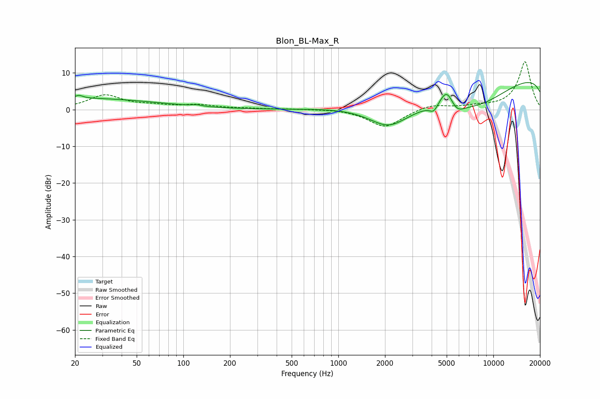

# Blon_BL-Max_R
See [usage instructions](https://github.com/jaakkopasanen/AutoEq#usage) for more options and info.

### Parametric EQs
Apply preamp of -7.5 dB when using parametric equalizer.

|   # | Type    |   Fc (Hz) |    Q |   Gain (dB) |
|-----|---------|-----------|------|-------------|
|   1 | Peaking |        20 | 0.25 |         3.1 |
|   2 | Peaking |        21 | 5.79 |         0.8 |
|   3 | Peaking |       122 | 4.5  |         0.4 |
|   4 | Peaking |      1794 | 0.37 |        -0.7 |
|   5 | Peaking |      2115 | 1.04 |        -6.5 |
|   6 | Peaking |      4125 | 5.44 |        -2   |
|   7 | Peaking |      4995 | 3.2  |         5.1 |
|   8 | Peaking |      5803 | 2.94 |        -2.4 |
|   9 | Peaking |      7825 | 0.37 |       -13.9 |
|  10 | Peaking |     10000 | 0.19 |        16.2 |

### Fixed Band EQs
When using fixed band (also called graphic) equalizer, apply preamp of **-13.1 dB** (if available) and set gains manually with these parameters.

|   # | Type    |   Fc (Hz) |    Q |   Gain (dB) |
|-----|---------|-----------|------|-------------|
|   1 | Peaking |        31 | 1.41 |         3.8 |
|   2 | Peaking |        62 | 1.41 |         0.9 |
|   3 | Peaking |       125 | 1.41 |         1.1 |
|   4 | Peaking |       250 | 1.41 |         0.2 |
|   5 | Peaking |       500 | 1.41 |         0.1 |
|   6 | Peaking |      1000 | 1.41 |         0.3 |
|   7 | Peaking |      2000 | 1.41 |        -4.8 |
|   8 | Peaking |      4000 | 1.41 |         1.5 |
|   9 | Peaking |      8000 | 1.41 |         0.7 |
|  10 | Peaking |     16000 | 1.41 |        13.1 |

### Graphs

