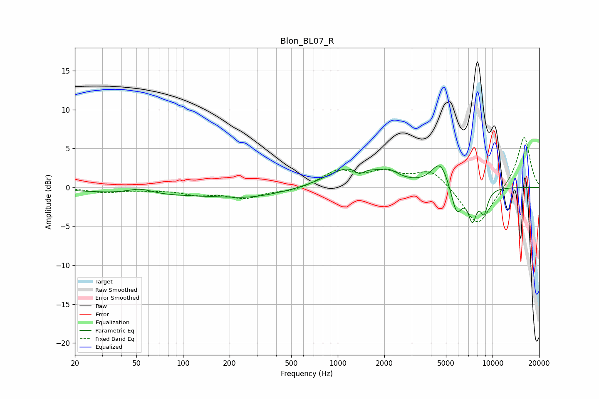

# Blon_BL07_R
See [usage instructions](https://github.com/jaakkopasanen/AutoEq#usage) for more options and info.

### Parametric EQs
Apply preamp of -2.9 dB when using parametric equalizer.

|   # | Type    |   Fc (Hz) |    Q |   Gain (dB) |
|-----|---------|-----------|------|-------------|
|   1 | Peaking |        53 | 1.82 |         0.7 |
|   2 | Peaking |       132 | 0.18 |        -1.1 |
|   3 | Peaking |       270 | 0.95 |        -0.4 |
|   4 | Peaking |      1240 | 0.88 |         2.9 |
|   5 | Peaking |      1379 | 4.29 |        -1   |
|   6 | Peaking |      2156 | 2.4  |         1   |
|   7 | Peaking |      4598 | 2.48 |         3.3 |
|   8 | Peaking |      5862 | 3.71 |        -3.8 |
|   9 | Peaking |      7404 | 4.86 |        -3.8 |
|  10 | Peaking |      8809 | 5.19 |        -2.9 |

### Fixed Band EQs
When using fixed band (also called graphic) equalizer, apply preamp of **-6.5 dB** (if available) and set gains manually with these parameters.

|   # | Type    |   Fc (Hz) |    Q |   Gain (dB) |
|-----|---------|-----------|------|-------------|
|   1 | Peaking |        31 | 1.41 |        -0.6 |
|   2 | Peaking |        62 | 1.41 |        -0.2 |
|   3 | Peaking |       125 | 1.41 |        -0.8 |
|   4 | Peaking |       250 | 1.41 |        -1.3 |
|   5 | Peaking |       500 | 1.41 |        -0.5 |
|   6 | Peaking |      1000 | 1.41 |         2   |
|   7 | Peaking |      2000 | 1.41 |         1.7 |
|   8 | Peaking |      4000 | 1.41 |         2.2 |
|   9 | Peaking |      8000 | 1.41 |        -5.2 |
|  10 | Peaking |     16000 | 1.41 |         6.7 |

### Graphs

