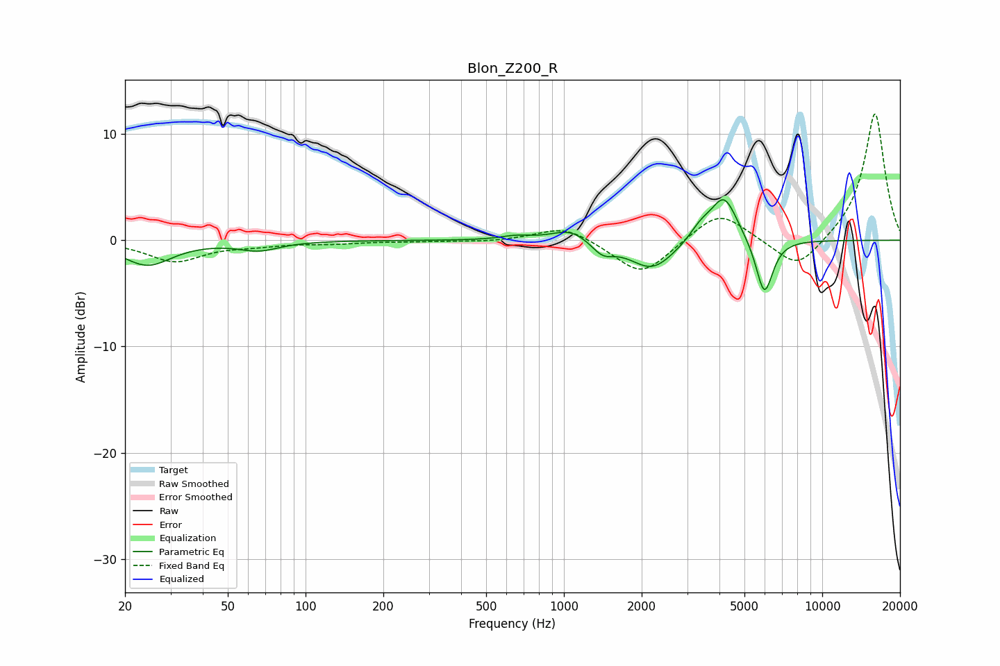

# Blon_Z200_R
See [usage instructions](https://github.com/jaakkopasanen/AutoEq#usage) for more options and info.

### Parametric EQs
Apply preamp of -3.9 dB when using parametric equalizer.

|   # | Type    |   Fc (Hz) |    Q |   Gain (dB) |
|-----|---------|-----------|------|-------------|
|   1 | Peaking |        24 | 1.51 |        -2.3 |
|   2 | Peaking |        66 | 1.81 |        -0.8 |
|   3 | Peaking |       652 | 2.38 |         0.4 |
|   4 | Peaking |      1064 | 1.95 |         1.2 |
|   5 | Peaking |      1411 | 3.26 |        -1.2 |
|   6 | Peaking |      2190 | 1.97 |        -0.4 |
|   7 | Peaking |      2197 | 1.58 |        -2.4 |
|   8 | Peaking |      3374 | 3.3  |         1.2 |
|   9 | Peaking |      4168 | 2.68 |         4.3 |
|  10 | Peaking |      5970 | 4.18 |        -5.3 |

### Fixed Band EQs
When using fixed band (also called graphic) equalizer, apply preamp of **-12.0 dB** (if available) and set gains manually with these parameters.

|   # | Type    |   Fc (Hz) |    Q |   Gain (dB) |
|-----|---------|-----------|------|-------------|
|   1 | Peaking |        31 | 1.41 |        -2   |
|   2 | Peaking |        62 | 1.41 |        -0.4 |
|   3 | Peaking |       125 | 1.41 |        -0.3 |
|   4 | Peaking |       250 | 1.41 |        -0.1 |
|   5 | Peaking |       500 | 1.41 |        -0.2 |
|   6 | Peaking |      1000 | 1.41 |         1.4 |
|   7 | Peaking |      2000 | 1.41 |        -3.4 |
|   8 | Peaking |      4000 | 1.41 |         2.9 |
|   9 | Peaking |      8000 | 1.41 |        -3   |
|  10 | Peaking |     16000 | 1.41 |        12.1 |

### Graphs

