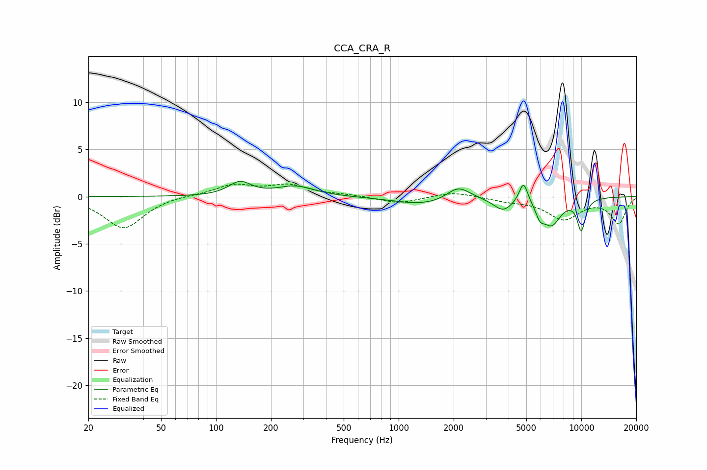

# CCA_CRA_R
See [usage instructions](https://github.com/jaakkopasanen/AutoEq#usage) for more options and info.

### Parametric EQs
Apply preamp of -1.7 dB when using parametric equalizer.

|   # | Type    |   Fc (Hz) |    Q |   Gain (dB) |
|-----|---------|-----------|------|-------------|
|   1 | Peaking |       135 | 2.33 |         1.4 |
|   2 | Peaking |       177 | 1.12 |        -0   |
|   3 | Peaking |       272 | 1.38 |         1.1 |
|   4 | Peaking |      1389 | 0.86 |        -0.9 |
|   5 | Peaking |      2121 | 2.2  |         1.5 |
|   6 | Peaking |      3724 | 2.75 |        -1.3 |
|   7 | Peaking |      4826 | 5.83 |         2.3 |
|   8 | Peaking |      5943 | 6    |        -1.2 |
|   9 | Peaking |      6861 | 2.62 |        -2.8 |
|  10 | Peaking |     10000 | 5.37 |        -3.3 |

### Fixed Band EQs
When using fixed band (also called graphic) equalizer, apply preamp of **-1.4 dB** (if available) and set gains manually with these parameters.

|   # | Type    |   Fc (Hz) |    Q |   Gain (dB) |
|-----|---------|-----------|------|-------------|
|   1 | Peaking |        31 | 1.41 |        -3.4 |
|   2 | Peaking |        62 | 1.41 |         0.2 |
|   3 | Peaking |       125 | 1.41 |         1.2 |
|   4 | Peaking |       250 | 1.41 |         1.1 |
|   5 | Peaking |       500 | 1.41 |         0.2 |
|   6 | Peaking |      1000 | 1.41 |        -0.7 |
|   7 | Peaking |      2000 | 1.41 |         0.5 |
|   8 | Peaking |      4000 | 1.41 |        -0.4 |
|   9 | Peaking |      8000 | 1.41 |        -2.3 |
|  10 | Peaking |     16000 | 1.41 |        -2.8 |

### Graphs

