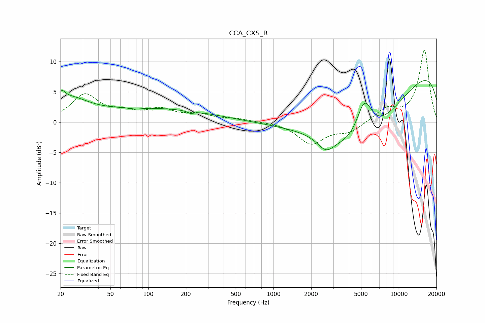

# CCA_CXS_R
See [usage instructions](https://github.com/jaakkopasanen/AutoEq#usage) for more options and info.

### Parametric EQs
Apply preamp of -6.9 dB when using parametric equalizer.

|   # | Type    |   Fc (Hz) |    Q |   Gain (dB) |
|-----|---------|-----------|------|-------------|
|   1 | Peaking |        20 | 5.38 |         1.4 |
|   2 | Peaking |        23 | 0.9  |         3.4 |
|   3 | Peaking |        80 | 3.39 |        -0.2 |
|   4 | Peaking |       117 | 0.31 |         2.1 |
|   5 | Peaking |       218 | 5.93 |        -0.4 |
|   6 | Peaking |      1283 | 3.69 |        -0   |
|   7 | Peaking |      2623 | 2.09 |        -2.3 |
|   8 | Peaking |      5102 | 0.41 |       -14.1 |
|   9 | Peaking |      5318 | 2.03 |         7.2 |
|  10 | Peaking |     10000 | 0.18 |        11.3 |

### Fixed Band EQs
When using fixed band (also called graphic) equalizer, apply preamp of **-12.0 dB** (if available) and set gains manually with these parameters.

|   # | Type    |   Fc (Hz) |    Q |   Gain (dB) |
|-----|---------|-----------|------|-------------|
|   1 | Peaking |        31 | 1.41 |         4.4 |
|   2 | Peaking |        62 | 1.41 |         1.2 |
|   3 | Peaking |       125 | 1.41 |         1.9 |
|   4 | Peaking |       250 | 1.41 |         1.1 |
|   5 | Peaking |       500 | 1.41 |         0.5 |
|   6 | Peaking |      1000 | 1.41 |         0.1 |
|   7 | Peaking |      2000 | 1.41 |        -3.5 |
|   8 | Peaking |      4000 | 1.41 |        -1.5 |
|   9 | Peaking |      8000 | 1.41 |         2.1 |
|  10 | Peaking |     16000 | 1.41 |        11.9 |

### Graphs

