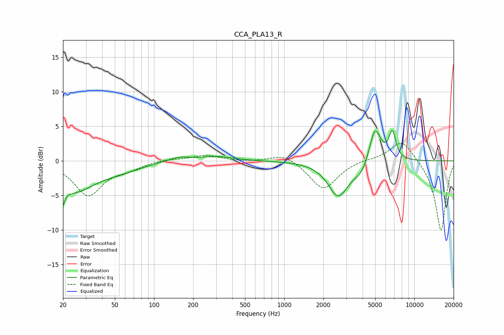

# CCA_PLA13_R
See [usage instructions](https://github.com/jaakkopasanen/AutoEq#usage) for more options and info.

### Parametric EQs
Apply preamp of -4.5 dB when using parametric equalizer.

|   # | Type    |   Fc (Hz) |    Q |   Gain (dB) |
|-----|---------|-----------|------|-------------|
|   1 | Peaking |        20 | 5.89 |        -5.1 |
|   2 | Peaking |        20 | 5.95 |         2.6 |
|   3 | Peaking |        24 | 0.85 |        -4.1 |
|   4 | Peaking |        55 | 0.89 |        -0.9 |
|   5 | Peaking |       154 | 1.62 |         0.6 |
|   6 | Peaking |       304 | 1.12 |         0.6 |
|   7 | Peaking |      2597 | 1.82 |        -4.9 |
|   8 | Peaking |      3984 | 2.06 |        -1.9 |
|   9 | Peaking |      4963 | 2.99 |         5.5 |
|  10 | Peaking |      6779 | 5    |         3.9 |

### Fixed Band EQs
When using fixed band (also called graphic) equalizer, apply preamp of **-2.6 dB** (if available) and set gains manually with these parameters.

|   # | Type    |   Fc (Hz) |    Q |   Gain (dB) |
|-----|---------|-----------|------|-------------|
|   1 | Peaking |        31 | 1.41 |        -4.9 |
|   2 | Peaking |        62 | 1.41 |        -0.9 |
|   3 | Peaking |       125 | 1.41 |         0.3 |
|   4 | Peaking |       250 | 1.41 |         0.8 |
|   5 | Peaking |       500 | 1.41 |        -0.1 |
|   6 | Peaking |      1000 | 1.41 |         1.2 |
|   7 | Peaking |      2000 | 1.41 |        -4.2 |
|   8 | Peaking |      4000 | 1.41 |         0.3 |
|   9 | Peaking |      8000 | 1.41 |         3.2 |
|  10 | Peaking |     16000 | 1.41 |       -10.2 |

### Graphs

