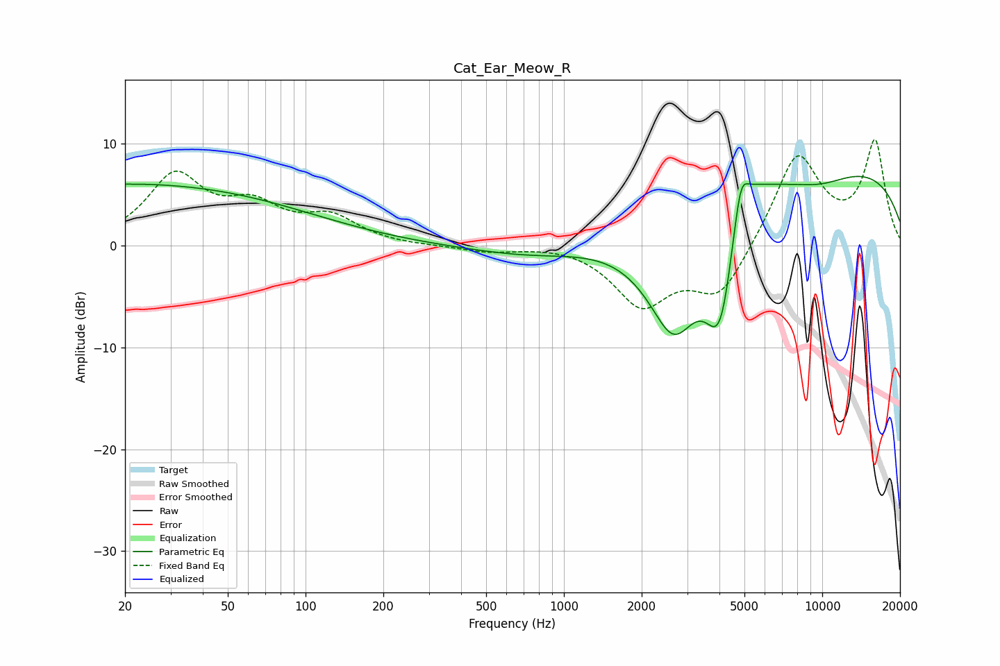

# Cat_Ear_Meow_R
See [usage instructions](https://github.com/jaakkopasanen/AutoEq#usage) for more options and info.

### Parametric EQs
Apply preamp of -6.9 dB when using parametric equalizer.

|   # | Type    |   Fc (Hz) |    Q |   Gain (dB) |
|-----|---------|-----------|------|-------------|
|   1 | Peaking |        20 | 0.19 |         6   |
|   2 | Peaking |        21 | 5.69 |        -0   |
|   3 | Peaking |       794 | 0.58 |        -1.3 |
|   4 | Peaking |      2667 | 1.16 |       -12.6 |
|   5 | Peaking |      3953 | 2.32 |        -8.9 |
|   6 | Peaking |      4161 | 3.97 |        -2.2 |
|   7 | Peaking |      4837 | 5.63 |         3.3 |
|   8 | Peaking |      4960 | 1.77 |         4.1 |
|   9 | Peaking |      8882 | 0.18 |         8.5 |
|  10 | Peaking |      9688 | 0.9  |        -1.8 |

### Fixed Band EQs
When using fixed band (also called graphic) equalizer, apply preamp of **-10.5 dB** (if available) and set gains manually with these parameters.

|   # | Type    |   Fc (Hz) |    Q |   Gain (dB) |
|-----|---------|-----------|------|-------------|
|   1 | Peaking |        31 | 1.41 |         6.6 |
|   2 | Peaking |        62 | 1.41 |         3.2 |
|   3 | Peaking |       125 | 1.41 |         2.5 |
|   4 | Peaking |       250 | 1.41 |        -0.1 |
|   5 | Peaking |       500 | 1.41 |        -0.6 |
|   6 | Peaking |      1000 | 1.41 |         0.2 |
|   7 | Peaking |      2000 | 1.41 |        -5.6 |
|   8 | Peaking |      4000 | 1.41 |        -5.1 |
|   9 | Peaking |      8000 | 1.41 |         9.1 |
|  10 | Peaking |     16000 | 1.41 |        10   |

### Graphs

