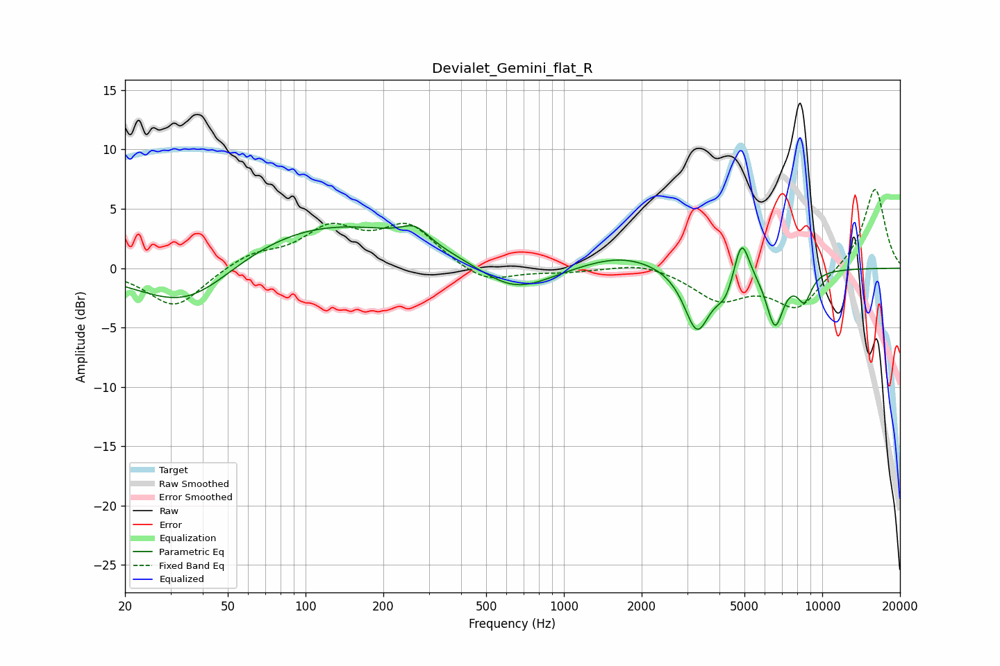

# Devialet_Gemini_flat_R
See [usage instructions](https://github.com/jaakkopasanen/AutoEq#usage) for more options and info.

### Parametric EQs
Apply preamp of -3.7 dB when using parametric equalizer.

|   # | Type    |   Fc (Hz) |    Q |   Gain (dB) |
|-----|---------|-----------|------|-------------|
|   1 | Peaking |        35 | 0.74 |        -4.4 |
|   2 | Peaking |       113 | 0.34 |         4.1 |
|   3 | Peaking |       266 | 2.68 |         1.3 |
|   4 | Peaking |       644 | 0.99 |        -2.5 |
|   5 | Peaking |      1681 | 0.9  |         1.3 |
|   6 | Peaking |      3275 | 2.82 |        -5.3 |
|   7 | Peaking |      4228 | 3.62 |        -1.9 |
|   8 | Peaking |      4867 | 4.66 |         3.8 |
|   9 | Peaking |      6560 | 4.07 |        -4.6 |
|  10 | Peaking |      8528 | 4.52 |        -2.3 |

### Fixed Band EQs
When using fixed band (also called graphic) equalizer, apply preamp of **-6.7 dB** (if available) and set gains manually with these parameters.

|   # | Type    |   Fc (Hz) |    Q |   Gain (dB) |
|-----|---------|-----------|------|-------------|
|   1 | Peaking |        31 | 1.41 |        -3.4 |
|   2 | Peaking |        62 | 1.41 |         1.2 |
|   3 | Peaking |       125 | 1.41 |         3.1 |
|   4 | Peaking |       250 | 1.41 |         3.4 |
|   5 | Peaking |       500 | 1.41 |        -1.4 |
|   6 | Peaking |      1000 | 1.41 |        -0.3 |
|   7 | Peaking |      2000 | 1.41 |         0.6 |
|   8 | Peaking |      4000 | 1.41 |        -2.5 |
|   9 | Peaking |      8000 | 1.41 |        -3.3 |
|  10 | Peaking |     16000 | 1.41 |         6.9 |

### Graphs

