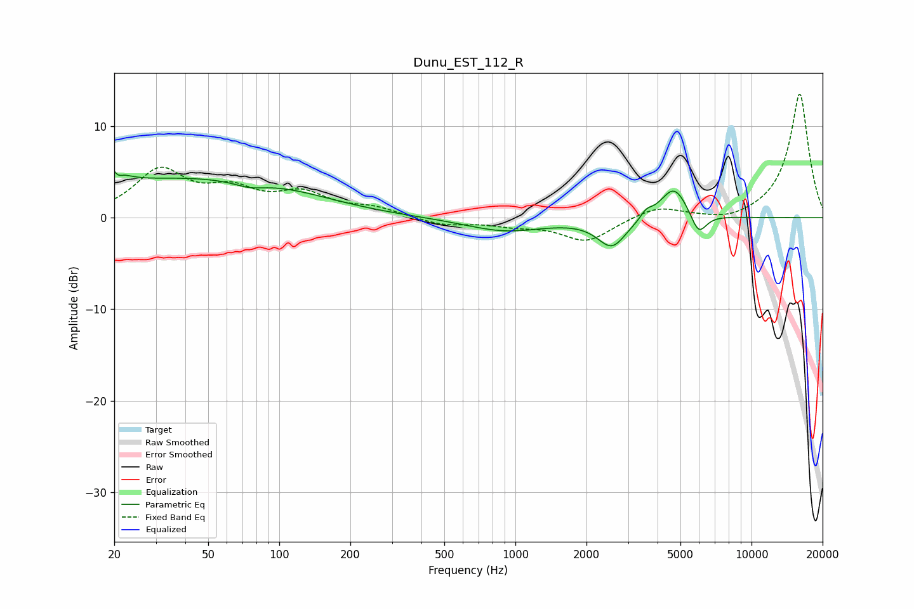

# Dunu_EST_112_R
See [usage instructions](https://github.com/jaakkopasanen/AutoEq#usage) for more options and info.

### Parametric EQs
Apply preamp of -5.2 dB when using parametric equalizer.

|   # | Type    |   Fc (Hz) |    Q |   Gain (dB) |
|-----|---------|-----------|------|-------------|
|   1 | Peaking |        20 | 4.21 |         4.3 |
|   2 | Peaking |        20 | 5.83 |        -3   |
|   3 | Peaking |        35 | 0.32 |         4   |
|   4 | Peaking |        75 | 2.18 |        -0.6 |
|   5 | Peaking |       111 | 0.6  |         1.1 |
|   6 | Peaking |       908 | 0.84 |        -1.5 |
|   7 | Peaking |      2564 | 2.32 |        -3.1 |
|   8 | Peaking |      3583 | 5.87 |         0.8 |
|   9 | Peaking |      4695 | 2.38 |         3.6 |
|  10 | Peaking |      5966 | 4.05 |        -2.5 |

### Fixed Band EQs
When using fixed band (also called graphic) equalizer, apply preamp of **-13.6 dB** (if available) and set gains manually with these parameters.

|   # | Type    |   Fc (Hz) |    Q |   Gain (dB) |
|-----|---------|-----------|------|-------------|
|   1 | Peaking |        31 | 1.41 |         5   |
|   2 | Peaking |        62 | 1.41 |         2.5 |
|   3 | Peaking |       125 | 1.41 |         2.4 |
|   4 | Peaking |       250 | 1.41 |         0.9 |
|   5 | Peaking |       500 | 1.41 |        -0.8 |
|   6 | Peaking |      1000 | 1.41 |        -0.7 |
|   7 | Peaking |      2000 | 1.41 |        -2.6 |
|   8 | Peaking |      4000 | 1.41 |         1.3 |
|   9 | Peaking |      8000 | 1.41 |        -0.6 |
|  10 | Peaking |     16000 | 1.41 |        13.6 |

### Graphs

