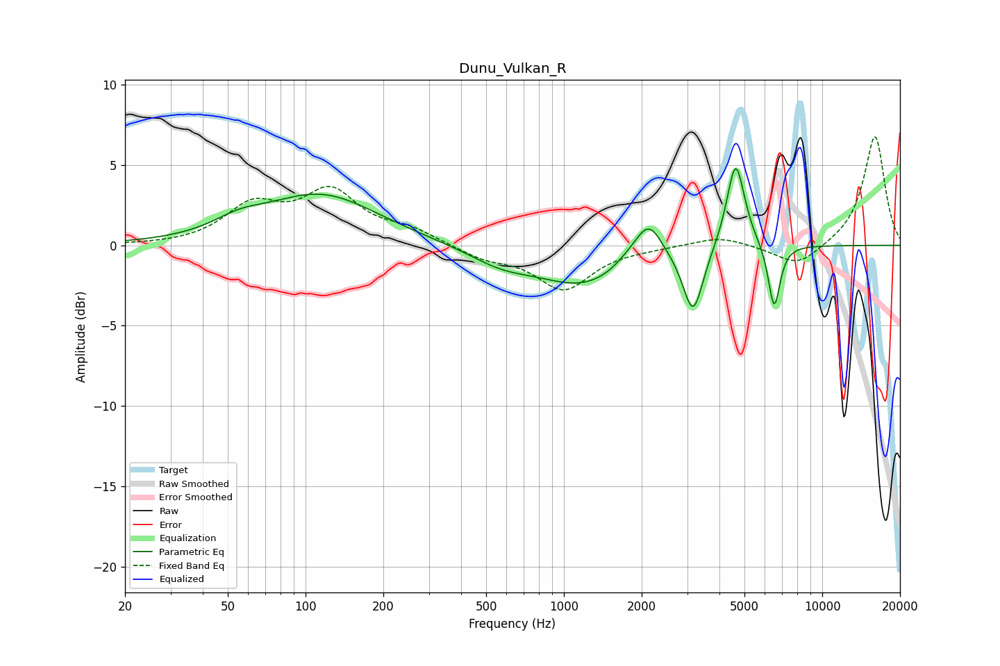

# Dunu_Vulkan_R
See [usage instructions](https://github.com/jaakkopasanen/AutoEq#usage) for more options and info.

### Parametric EQs
Apply preamp of -4.9 dB when using parametric equalizer.

|   # | Type    |   Fc (Hz) |    Q |   Gain (dB) |
|-----|---------|-----------|------|-------------|
|   1 | Peaking |        55 | 1.47 |         0.7 |
|   2 | Peaking |       114 | 0.64 |         3.1 |
|   3 | Peaking |       568 | 1.15 |        -0.9 |
|   4 | Peaking |      1225 | 0.74 |        -2.5 |
|   5 | Peaking |      1796 | 2.08 |         0.6 |
|   6 | Peaking |      2133 | 2.67 |         2.4 |
|   7 | Peaking |      3163 | 3.64 |        -4.1 |
|   8 | Peaking |      4622 | 4.28 |         4.5 |
|   9 | Peaking |      4625 | 2.87 |         1.1 |
|  10 | Peaking |      6518 | 5.99 |        -4   |

### Fixed Band EQs
When using fixed band (also called graphic) equalizer, apply preamp of **-6.8 dB** (if available) and set gains manually with these parameters.

|   # | Type    |   Fc (Hz) |    Q |   Gain (dB) |
|-----|---------|-----------|------|-------------|
|   1 | Peaking |        31 | 1.41 |        -0   |
|   2 | Peaking |        62 | 1.41 |         2.3 |
|   3 | Peaking |       125 | 1.41 |         3.1 |
|   4 | Peaking |       250 | 1.41 |         0.8 |
|   5 | Peaking |       500 | 1.41 |        -0.7 |
|   6 | Peaking |      1000 | 1.41 |        -2.7 |
|   7 | Peaking |      2000 | 1.41 |        -0.1 |
|   8 | Peaking |      4000 | 1.41 |         0.6 |
|   9 | Peaking |      8000 | 1.41 |        -1.4 |
|  10 | Peaking |     16000 | 1.41 |         6.8 |

### Graphs

