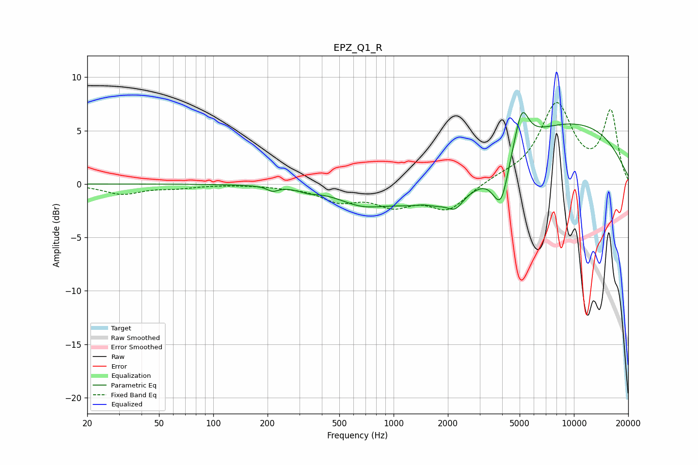

# EPZ_Q1_R
See [usage instructions](https://github.com/jaakkopasanen/AutoEq#usage) for more options and info.

### Parametric EQs
Apply preamp of -6.8 dB when using parametric equalizer.

|   # | Type    |   Fc (Hz) |    Q |   Gain (dB) |
|-----|---------|-----------|------|-------------|
|   1 | Peaking |       213 | 5.01 |        -0.4 |
|   2 | Peaking |       338 | 2.86 |        -0.3 |
|   3 | Peaking |       662 | 1.07 |        -1.3 |
|   4 | Peaking |      1458 | 3.18 |         0.2 |
|   5 | Peaking |      2028 | 0.56 |        -3.5 |
|   6 | Peaking |      2202 | 3.76 |        -0.9 |
|   7 | Peaking |      3962 | 2.78 |        -6   |
|   8 | Peaking |      4239 | 1.8  |         2.1 |
|   9 | Peaking |      5149 | 3.86 |         3.3 |
|  10 | Peaking |      8765 | 0.29 |         5.9 |

### Fixed Band EQs
When using fixed band (also called graphic) equalizer, apply preamp of **-7.7 dB** (if available) and set gains manually with these parameters.

|   # | Type    |   Fc (Hz) |    Q |   Gain (dB) |
|-----|---------|-----------|------|-------------|
|   1 | Peaking |        31 | 1.41 |        -0.9 |
|   2 | Peaking |        62 | 1.41 |        -0.3 |
|   3 | Peaking |       125 | 1.41 |        -0   |
|   4 | Peaking |       250 | 1.41 |        -0.2 |
|   5 | Peaking |       500 | 1.41 |        -1.4 |
|   6 | Peaking |      1000 | 1.41 |        -1.7 |
|   7 | Peaking |      2000 | 1.41 |        -2.3 |
|   8 | Peaking |      4000 | 1.41 |         0.4 |
|   9 | Peaking |      8000 | 1.41 |         7.3 |
|  10 | Peaking |     16000 | 1.41 |         6.6 |

### Graphs

