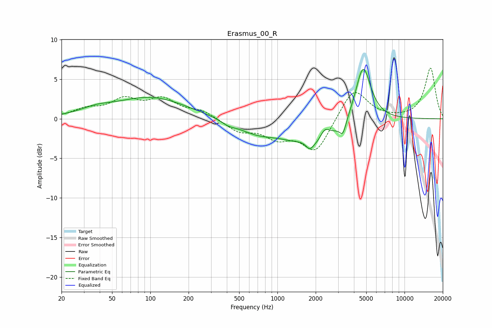

# Erasmus_00_R
See [usage instructions](https://github.com/jaakkopasanen/AutoEq#usage) for more options and info.

### Parametric EQs
Apply preamp of -6.3 dB when using parametric equalizer.

|   # | Type    |   Fc (Hz) |    Q |   Gain (dB) |
|-----|---------|-----------|------|-------------|
|   1 | Peaking |        37 | 1.14 |         0.7 |
|   2 | Peaking |       102 | 0.5  |         2.7 |
|   3 | Peaking |       411 | 2.75 |        -0.4 |
|   4 | Peaking |       692 | 0.85 |        -1.6 |
|   5 | Peaking |      1567 | 2.48 |         0.6 |
|   6 | Peaking |      1794 | 5.43 |        -0.7 |
|   7 | Peaking |      1896 | 0.83 |        -3.8 |
|   8 | Peaking |      2355 | 3.56 |         1.6 |
|   9 | Peaking |      3275 | 5.5  |        -1.7 |
|  10 | Peaking |      4723 | 2.31 |         7.2 |

### Fixed Band EQs
When using fixed band (also called graphic) equalizer, apply preamp of **-6.5 dB** (if available) and set gains manually with these parameters.

|   # | Type    |   Fc (Hz) |    Q |   Gain (dB) |
|-----|---------|-----------|------|-------------|
|   1 | Peaking |        31 | 1.41 |         1.1 |
|   2 | Peaking |        62 | 1.41 |         2.2 |
|   3 | Peaking |       125 | 1.41 |         2.2 |
|   4 | Peaking |       250 | 1.41 |         1   |
|   5 | Peaking |       500 | 1.41 |        -1.5 |
|   6 | Peaking |      1000 | 1.41 |        -2.1 |
|   7 | Peaking |      2000 | 1.41 |        -4.2 |
|   8 | Peaking |      4000 | 1.41 |         4   |
|   9 | Peaking |      8000 | 1.41 |        -0   |
|  10 | Peaking |     16000 | 1.41 |         6.4 |

### Graphs

