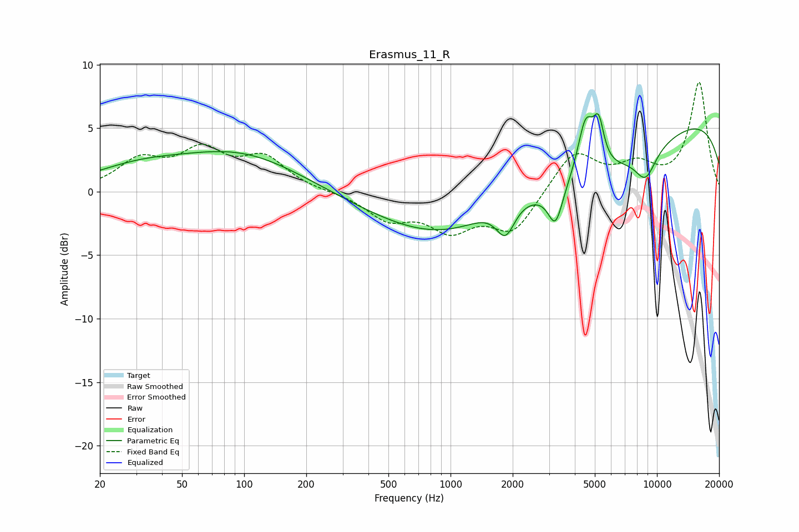

# Erasmus_11_R
See [usage instructions](https://github.com/jaakkopasanen/AutoEq#usage) for more options and info.

### Parametric EQs
Apply preamp of -6.2 dB when using parametric equalizer.

|   # | Type    |   Fc (Hz) |    Q |   Gain (dB) |
|-----|---------|-----------|------|-------------|
|   1 | Peaking |        30 | 0.6  |         1.5 |
|   2 | Peaking |        96 | 0.48 |         2.9 |
|   3 | Peaking |      1847 | 2.96 |        -2.8 |
|   4 | Peaking |      1872 | 0.96 |         2.1 |
|   5 | Peaking |      2367 | 0.2  |        -5.6 |
|   6 | Peaking |      3223 | 4.06 |        -2.9 |
|   7 | Peaking |      4514 | 3.51 |         4.5 |
|   8 | Peaking |      5223 | 5.54 |         3   |
|   9 | Peaking |      8811 | 2.49 |        -2.3 |
|  10 | Peaking |     10000 | 0.18 |         6.7 |

### Fixed Band EQs
When using fixed band (also called graphic) equalizer, apply preamp of **-8.7 dB** (if available) and set gains manually with these parameters.

|   # | Type    |   Fc (Hz) |    Q |   Gain (dB) |
|-----|---------|-----------|------|-------------|
|   1 | Peaking |        31 | 1.41 |         2.3 |
|   2 | Peaking |        62 | 1.41 |         2.9 |
|   3 | Peaking |       125 | 1.41 |         2.5 |
|   4 | Peaking |       250 | 1.41 |        -0   |
|   5 | Peaking |       500 | 1.41 |        -2   |
|   6 | Peaking |      1000 | 1.41 |        -2.7 |
|   7 | Peaking |      2000 | 1.41 |        -3.1 |
|   8 | Peaking |      4000 | 1.41 |         3.2 |
|   9 | Peaking |      8000 | 1.41 |         1.8 |
|  10 | Peaking |     16000 | 1.41 |         8.5 |

### Graphs

