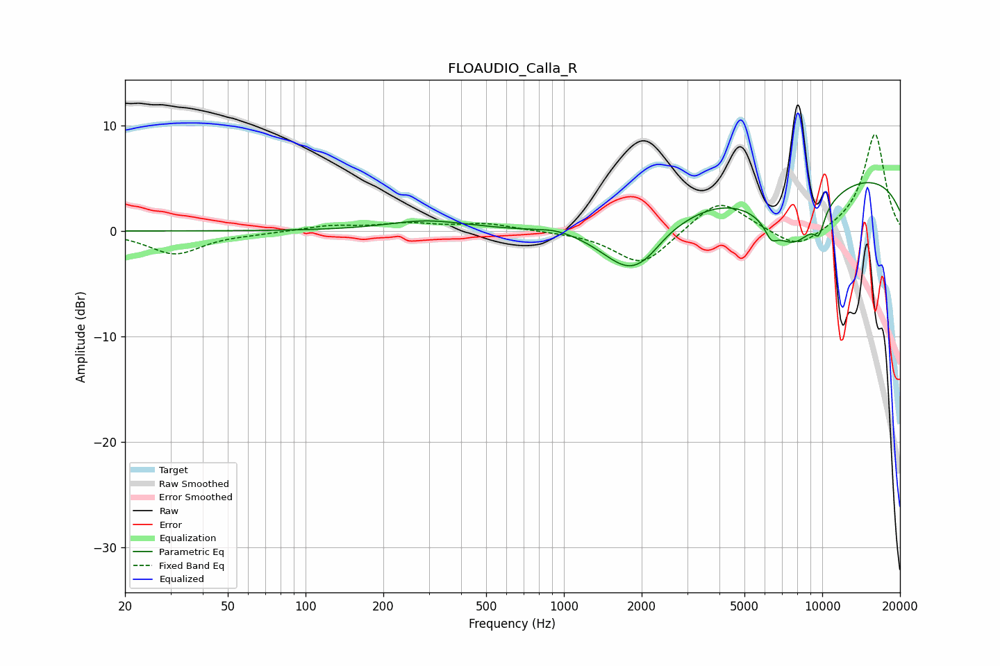

# FLOAUDIO_Calla_R
See [usage instructions](https://github.com/jaakkopasanen/AutoEq#usage) for more options and info.

### Parametric EQs
Apply preamp of -4.7 dB when using parametric equalizer.

|   # | Type    |   Fc (Hz) |    Q |   Gain (dB) |
|-----|---------|-----------|------|-------------|
|   1 | Peaking |       294 | 0.94 |         0.9 |
|   2 | Peaking |       455 | 4.17 |         0   |
|   3 | Peaking |       932 | 2.1  |         0.3 |
|   4 | Peaking |      1709 | 1.31 |        -1.7 |
|   5 | Peaking |      1945 | 1.19 |        -4   |
|   6 | Peaking |      2512 | 2.66 |         0.3 |
|   7 | Peaking |      6337 | 5.91 |        -1.3 |
|   8 | Peaking |      7750 | 1.16 |        -6.3 |
|   9 | Peaking |      9711 | 6    |        -1.9 |
|  10 | Peaking |     10000 | 0.19 |         5.8 |

### Fixed Band EQs
When using fixed band (also called graphic) equalizer, apply preamp of **-9.3 dB** (if available) and set gains manually with these parameters.

|   # | Type    |   Fc (Hz) |    Q |   Gain (dB) |
|-----|---------|-----------|------|-------------|
|   1 | Peaking |        31 | 1.41 |        -2.2 |
|   2 | Peaking |        62 | 1.41 |        -0.2 |
|   3 | Peaking |       125 | 1.41 |         0.5 |
|   4 | Peaking |       250 | 1.41 |         0.6 |
|   5 | Peaking |       500 | 1.41 |         0.7 |
|   6 | Peaking |      1000 | 1.41 |        -0   |
|   7 | Peaking |      2000 | 1.41 |        -3.3 |
|   8 | Peaking |      4000 | 1.41 |         3.2 |
|   9 | Peaking |      8000 | 1.41 |        -1.9 |
|  10 | Peaking |     16000 | 1.41 |         9.3 |

### Graphs

