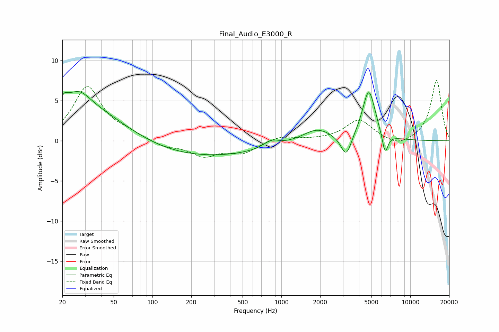

# Final_Audio_E3000_R
See [usage instructions](https://github.com/jaakkopasanen/AutoEq#usage) for more options and info.

### Parametric EQs
Apply preamp of -6.2 dB when using parametric equalizer.

|   # | Type    |   Fc (Hz) |    Q |   Gain (dB) |
|-----|---------|-----------|------|-------------|
|   1 | Peaking |        20 | 5.98 |        -3   |
|   2 | Peaking |        20 | 5.92 |         3.3 |
|   3 | Peaking |        24 | 0.37 |         5   |
|   4 | Peaking |        27 | 1.74 |         1.6 |
|   5 | Peaking |       215 | 0.26 |        -2.1 |
|   6 | Peaking |       834 | 2.42 |         0.9 |
|   7 | Peaking |      1892 | 1.26 |         1.6 |
|   8 | Peaking |      3182 | 3.42 |        -2.8 |
|   9 | Peaking |      4768 | 2.77 |         6.3 |
|  10 | Peaking |      6370 | 5.86 |        -2.7 |

### Fixed Band EQs
When using fixed band (also called graphic) equalizer, apply preamp of **-7.6 dB** (if available) and set gains manually with these parameters.

|   # | Type    |   Fc (Hz) |    Q |   Gain (dB) |
|-----|---------|-----------|------|-------------|
|   1 | Peaking |        31 | 1.41 |         6.7 |
|   2 | Peaking |        62 | 1.41 |         0.8 |
|   3 | Peaking |       125 | 1.41 |        -0.7 |
|   4 | Peaking |       250 | 1.41 |        -1.8 |
|   5 | Peaking |       500 | 1.41 |        -1.4 |
|   6 | Peaking |      1000 | 1.41 |         0.6 |
|   7 | Peaking |      2000 | 1.41 |         0.1 |
|   8 | Peaking |      4000 | 1.41 |         2.6 |
|   9 | Peaking |      8000 | 1.41 |        -0.8 |
|  10 | Peaking |     16000 | 1.41 |         7.6 |

### Graphs

