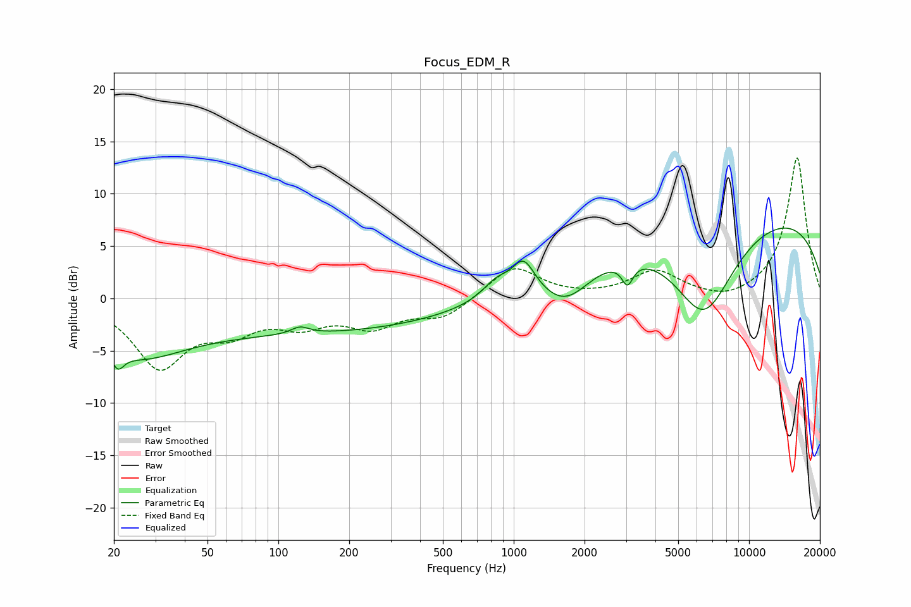

# Focus_EDM_R
See [usage instructions](https://github.com/jaakkopasanen/AutoEq#usage) for more options and info.

### Parametric EQs
Apply preamp of -6.8 dB when using parametric equalizer.

|   # | Type    |   Fc (Hz) |    Q |   Gain (dB) |
|-----|---------|-----------|------|-------------|
|   1 | Peaking |        21 | 5.44 |        -1.7 |
|   2 | Peaking |        25 | 0.76 |        -3.7 |
|   3 | Peaking |       119 | 0.19 |        -3.2 |
|   4 | Peaking |       124 | 3.68 |         0.7 |
|   5 | Peaking |       844 | 2.37 |         1.5 |
|   6 | Peaking |      1102 | 2.98 |         3   |
|   7 | Peaking |      1671 | 1.35 |        -3.2 |
|   8 | Peaking |      3043 | 5.99 |        -2.1 |
|   9 | Peaking |      6432 | 0.99 |        -9.5 |
|  10 | Peaking |      8822 | 0.18 |         8.8 |

### Fixed Band EQs
When using fixed band (also called graphic) equalizer, apply preamp of **-13.5 dB** (if available) and set gains manually with these parameters.

|   # | Type    |   Fc (Hz) |    Q |   Gain (dB) |
|-----|---------|-----------|------|-------------|
|   1 | Peaking |        31 | 1.41 |        -6.3 |
|   2 | Peaking |        62 | 1.41 |        -2.5 |
|   3 | Peaking |       125 | 1.41 |        -2.1 |
|   4 | Peaking |       250 | 1.41 |        -2.4 |
|   5 | Peaking |       500 | 1.41 |        -1.8 |
|   6 | Peaking |      1000 | 1.41 |         3.1 |
|   7 | Peaking |      2000 | 1.41 |         0   |
|   8 | Peaking |      4000 | 1.41 |         2.5 |
|   9 | Peaking |      8000 | 1.41 |        -0.6 |
|  10 | Peaking |     16000 | 1.41 |        13.5 |

### Graphs

