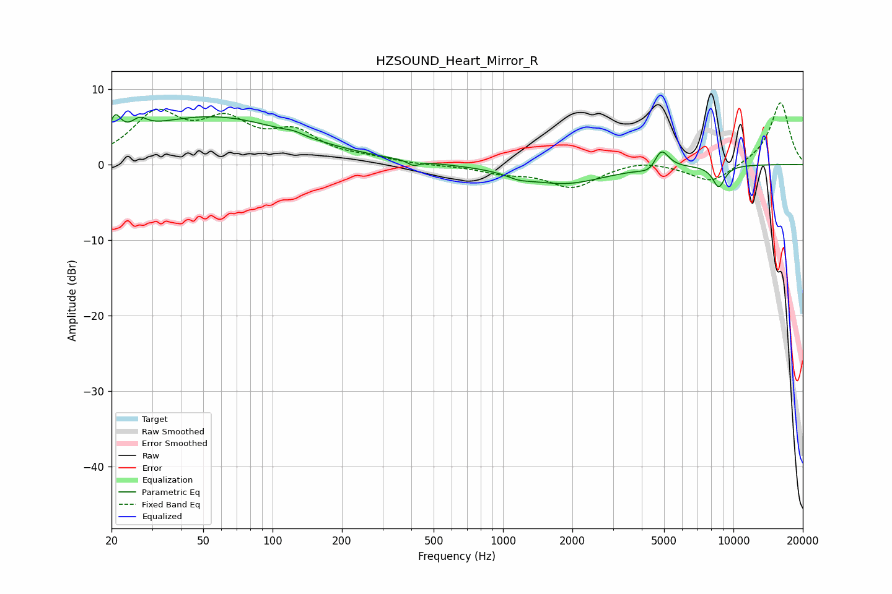

# HZSOUND_Heart_Mirror_R
See [usage instructions](https://github.com/jaakkopasanen/AutoEq#usage) for more options and info.

### Parametric EQs
Apply preamp of -6.7 dB when using parametric equalizer.

|   # | Type    |   Fc (Hz) |    Q |   Gain (dB) |
|-----|---------|-----------|------|-------------|
|   1 | Peaking |        21 | 6    |         2.7 |
|   2 | Peaking |        26 | 4.38 |         1.4 |
|   3 | Peaking |        54 | 0.38 |         6.3 |
|   4 | Peaking |       124 | 3.77 |         0.3 |
|   5 | Peaking |       409 | 5.99 |        -0.7 |
|   6 | Peaking |      1173 | 2.74 |        -0.6 |
|   7 | Peaking |      1840 | 0.8  |        -2.5 |
|   8 | Peaking |      4410 | 3.49 |        -1.2 |
|   9 | Peaking |      4844 | 4.18 |         3   |
|  10 | Peaking |      8635 | 4.77 |        -2.9 |

### Fixed Band EQs
When using fixed band (also called graphic) equalizer, apply preamp of **-8.3 dB** (if available) and set gains manually with these parameters.

|   # | Type    |   Fc (Hz) |    Q |   Gain (dB) |
|-----|---------|-----------|------|-------------|
|   1 | Peaking |        31 | 1.41 |         6.2 |
|   2 | Peaking |        62 | 1.41 |         4.9 |
|   3 | Peaking |       125 | 1.41 |         3.7 |
|   4 | Peaking |       250 | 1.41 |         0.6 |
|   5 | Peaking |       500 | 1.41 |        -0.1 |
|   6 | Peaking |      1000 | 1.41 |        -1   |
|   7 | Peaking |      2000 | 1.41 |        -3   |
|   8 | Peaking |      4000 | 1.41 |         0.7 |
|   9 | Peaking |      8000 | 1.41 |        -2.5 |
|  10 | Peaking |     16000 | 1.41 |         8.3 |

### Graphs

