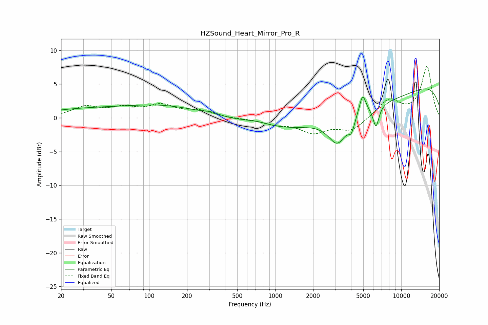

# HZSound_Heart_Mirror_Pro_R
See [usage instructions](https://github.com/jaakkopasanen/AutoEq#usage) for more options and info.

### Parametric EQs
Apply preamp of -4.4 dB when using parametric equalizer.

|   # | Type    |   Fc (Hz) |    Q |   Gain (dB) |
|-----|---------|-----------|------|-------------|
|   1 | Peaking |        30 | 0.41 |         1.1 |
|   2 | Peaking |       132 | 0.47 |         1.6 |
|   3 | Peaking |       309 | 2.67 |         0.3 |
|   4 | Peaking |       718 | 1.36 |         0.5 |
|   5 | Peaking |      3127 | 1.93 |        -4.2 |
|   6 | Peaking |      4025 | 5.71 |        -1.8 |
|   7 | Peaking |      4182 | 0.2  |        -5.7 |
|   8 | Peaking |      4937 | 5.52 |         2.9 |
|   9 | Peaking |      6306 | 5.64 |        -3.2 |
|  10 | Peaking |      8753 | 0.18 |         7.8 |

### Fixed Band EQs
When using fixed band (also called graphic) equalizer, apply preamp of **-7.7 dB** (if available) and set gains manually with these parameters.

|   # | Type    |   Fc (Hz) |    Q |   Gain (dB) |
|-----|---------|-----------|------|-------------|
|   1 | Peaking |        31 | 1.41 |         1.5 |
|   2 | Peaking |        62 | 1.41 |         1.2 |
|   3 | Peaking |       125 | 1.41 |         1.7 |
|   4 | Peaking |       250 | 1.41 |         0.9 |
|   5 | Peaking |       500 | 1.41 |        -0.1 |
|   6 | Peaking |      1000 | 1.41 |        -0.8 |
|   7 | Peaking |      2000 | 1.41 |        -2   |
|   8 | Peaking |      4000 | 1.41 |        -1.8 |
|   9 | Peaking |      8000 | 1.41 |         2.7 |
|  10 | Peaking |     16000 | 1.41 |         7.6 |

### Graphs

