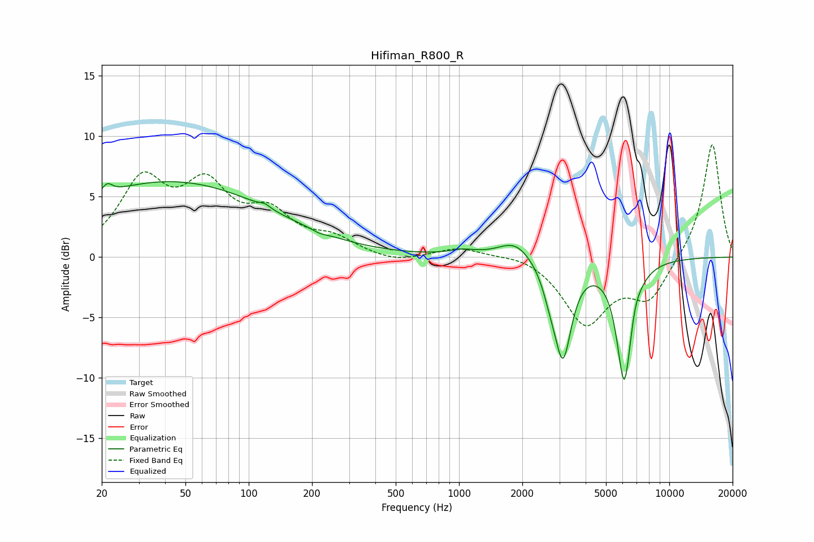

# Hifiman_R800_R
See [usage instructions](https://github.com/jaakkopasanen/AutoEq#usage) for more options and info.

### Parametric EQs
Apply preamp of -6.3 dB when using parametric equalizer.

|   # | Type    |   Fc (Hz) |    Q |   Gain (dB) |
|-----|---------|-----------|------|-------------|
|   1 | Peaking |        21 | 5.92 |         0.8 |
|   2 | Peaking |        42 | 0.28 |         6.2 |
|   3 | Peaking |       120 | 5.98 |         0.3 |
|   4 | Peaking |       217 | 4.67 |        -0.2 |
|   5 | Peaking |      1041 | 2.23 |         0.4 |
|   6 | Peaking |      1852 | 1.77 |         1.5 |
|   7 | Peaking |      2708 | 4.04 |        -1.4 |
|   8 | Peaking |      3120 | 3.45 |        -7.8 |
|   9 | Peaking |      6105 | 3.8  |       -10.1 |
|  10 | Peaking |      6858 | 5.99 |         0.6 |

### Fixed Band EQs
When using fixed band (also called graphic) equalizer, apply preamp of **-9.4 dB** (if available) and set gains manually with these parameters.

|   # | Type    |   Fc (Hz) |    Q |   Gain (dB) |
|-----|---------|-----------|------|-------------|
|   1 | Peaking |        31 | 1.41 |         5.9 |
|   2 | Peaking |        62 | 1.41 |         5.2 |
|   3 | Peaking |       125 | 1.41 |         3.1 |
|   4 | Peaking |       250 | 1.41 |         1.3 |
|   5 | Peaking |       500 | 1.41 |        -0.5 |
|   6 | Peaking |      1000 | 1.41 |         0.8 |
|   7 | Peaking |      2000 | 1.41 |         0.4 |
|   8 | Peaking |      4000 | 1.41 |        -5.4 |
|   9 | Peaking |      8000 | 1.41 |        -3.3 |
|  10 | Peaking |     16000 | 1.41 |         9.6 |

### Graphs

