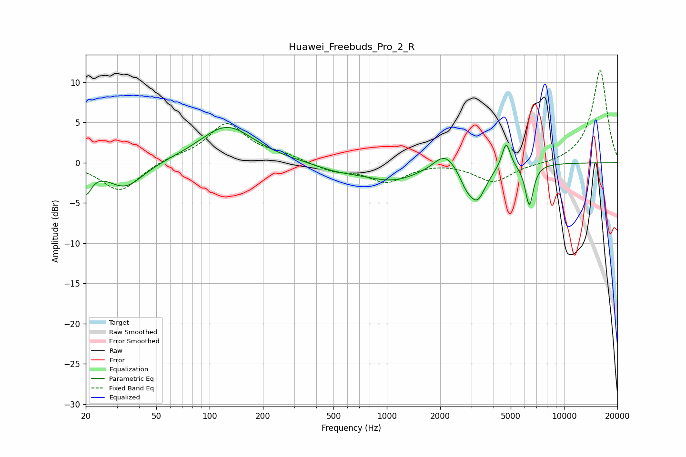

# Huawei_Freebuds_Pro_2_R
See [usage instructions](https://github.com/jaakkopasanen/AutoEq#usage) for more options and info.

### Parametric EQs
Apply preamp of -4.5 dB when using parametric equalizer.

|   # | Type    |   Fc (Hz) |    Q |   Gain (dB) |
|-----|---------|-----------|------|-------------|
|   1 | Peaking |        20 | 4.42 |        -3.1 |
|   2 | Peaking |        33 | 1.39 |        -3.1 |
|   3 | Peaking |       125 | 0.93 |         4.6 |
|   4 | Peaking |       522 | 1.15 |        -0.7 |
|   5 | Peaking |      1073 | 0.87 |        -2.1 |
|   6 | Peaking |      2125 | 2.29 |         2.1 |
|   7 | Peaking |      2792 | 4.1  |        -1.3 |
|   8 | Peaking |      3231 | 2.81 |        -4.3 |
|   9 | Peaking |      4711 | 5.86 |         3.3 |
|  10 | Peaking |      6371 | 6    |        -5.2 |

### Fixed Band EQs
When using fixed band (also called graphic) equalizer, apply preamp of **-11.5 dB** (if available) and set gains manually with these parameters.

|   # | Type    |   Fc (Hz) |    Q |   Gain (dB) |
|-----|---------|-----------|------|-------------|
|   1 | Peaking |        31 | 1.41 |        -3.6 |
|   2 | Peaking |        62 | 1.41 |         0.6 |
|   3 | Peaking |       125 | 1.41 |         4.8 |
|   4 | Peaking |       250 | 1.41 |         0.8 |
|   5 | Peaking |       500 | 1.41 |        -1   |
|   6 | Peaking |      1000 | 1.41 |        -2.3 |
|   7 | Peaking |      2000 | 1.41 |         0.2 |
|   8 | Peaking |      4000 | 1.41 |        -2.4 |
|   9 | Peaking |      8000 | 1.41 |        -0.2 |
|  10 | Peaking |     16000 | 1.41 |        11.6 |

### Graphs

