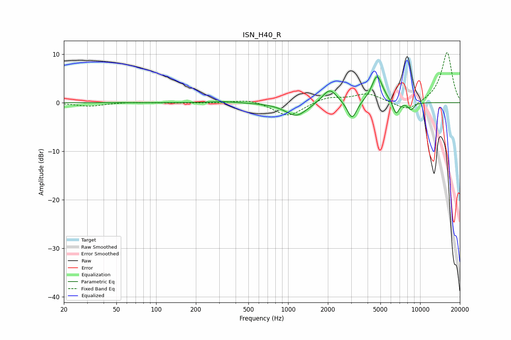

# ISN_H40_R
See [usage instructions](https://github.com/jaakkopasanen/AutoEq#usage) for more options and info.

### Parametric EQs
Apply preamp of -5.4 dB when using parametric equalizer.

|   # | Type    |   Fc (Hz) |    Q |   Gain (dB) |
|-----|---------|-----------|------|-------------|
|   1 | Peaking |       325 | 1.43 |         0.3 |
|   2 | Peaking |      1146 | 1.83 |        -2.4 |
|   3 | Peaking |      1237 | 1.14 |        -0.5 |
|   4 | Peaking |      1992 | 2    |         0.5 |
|   5 | Peaking |      2073 | 2.63 |         2.6 |
|   6 | Peaking |      3050 | 3.93 |        -3.8 |
|   7 | Peaking |      4716 | 3.48 |         5.3 |
|   8 | Peaking |      4861 | 1.86 |         0.4 |
|   9 | Peaking |      6567 | 5.67 |        -2.8 |
|  10 | Peaking |      8543 | 5.63 |        -1.5 |

### Fixed Band EQs
When using fixed band (also called graphic) equalizer, apply preamp of **-10.4 dB** (if available) and set gains manually with these parameters.

|   # | Type    |   Fc (Hz) |    Q |   Gain (dB) |
|-----|---------|-----------|------|-------------|
|   1 | Peaking |        31 | 1.41 |        -0.7 |
|   2 | Peaking |        62 | 1.41 |         0.1 |
|   3 | Peaking |       125 | 1.41 |        -0   |
|   4 | Peaking |       250 | 1.41 |        -0.1 |
|   5 | Peaking |       500 | 1.41 |         0.7 |
|   6 | Peaking |      1000 | 1.41 |        -2.9 |
|   7 | Peaking |      2000 | 1.41 |         1.2 |
|   8 | Peaking |      4000 | 1.41 |         1.8 |
|   9 | Peaking |      8000 | 1.41 |        -2   |
|  10 | Peaking |     16000 | 1.41 |        10.5 |

### Graphs

