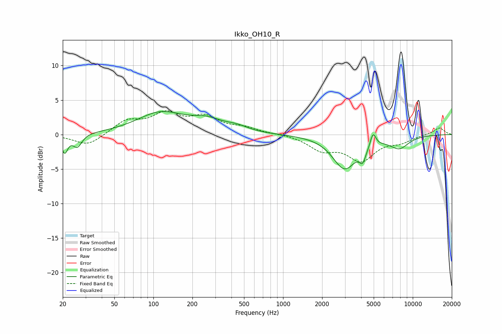

# Ikko_OH10_R
See [usage instructions](https://github.com/jaakkopasanen/AutoEq#usage) for more options and info.

### Parametric EQs
Apply preamp of -3.4 dB when using parametric equalizer.

|   # | Type    |   Fc (Hz) |    Q |   Gain (dB) |
|-----|---------|-----------|------|-------------|
|   1 | Peaking |        21 | 5.95 |        -2.5 |
|   2 | Peaking |        26 | 4.2  |        -1.8 |
|   3 | Peaking |       114 | 0.78 |         3   |
|   4 | Peaking |       259 | 1.17 |         1.5 |
|   5 | Peaking |       440 | 1.55 |         0.7 |
|   6 | Peaking |      2980 | 1.54 |        -4.8 |
|   7 | Peaking |      4104 | 6    |        -1.7 |
|   8 | Peaking |      4756 | 2.88 |        -0.6 |
|   9 | Peaking |      4934 | 6    |         2.4 |
|  10 | Peaking |      7871 | 1.8  |        -1.8 |

### Fixed Band EQs
When using fixed band (also called graphic) equalizer, apply preamp of **-3.5 dB** (if available) and set gains manually with these parameters.

|   # | Type    |   Fc (Hz) |    Q |   Gain (dB) |
|-----|---------|-----------|------|-------------|
|   1 | Peaking |        31 | 1.41 |        -1.7 |
|   2 | Peaking |        62 | 1.41 |         1.9 |
|   3 | Peaking |       125 | 1.41 |         2.7 |
|   4 | Peaking |       250 | 1.41 |         2.3 |
|   5 | Peaking |       500 | 1.41 |         0.8 |
|   6 | Peaking |      1000 | 1.41 |         0.1 |
|   7 | Peaking |      2000 | 1.41 |        -2   |
|   8 | Peaking |      4000 | 1.41 |        -3.5 |
|   9 | Peaking |      8000 | 1.41 |        -0.9 |
|  10 | Peaking |     16000 | 1.41 |         1   |

### Graphs

