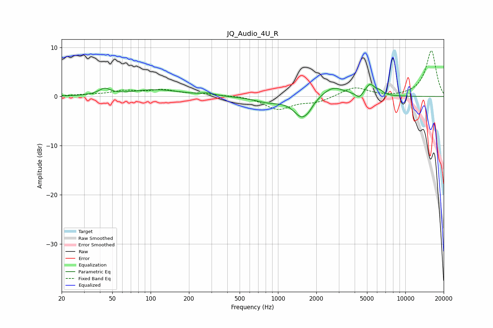

# JQ_Audio_4U_R
See [usage instructions](https://github.com/jaakkopasanen/AutoEq#usage) for more options and info.

### Parametric EQs
Apply preamp of -2.6 dB when using parametric equalizer.

|   # | Type    |   Fc (Hz) |    Q |   Gain (dB) |
|-----|---------|-----------|------|-------------|
|   1 | Peaking |        43 | 3.11 |         1.3 |
|   2 | Peaking |       110 | 0.73 |         1.4 |
|   3 | Peaking |       281 | 3.13 |         0.4 |
|   4 | Peaking |       840 | 1.31 |        -1   |
|   5 | Peaking |      1547 | 2.18 |        -4.2 |
|   6 | Peaking |      1754 | 5.12 |        -0.5 |
|   7 | Peaking |      2691 | 1.6  |         2.2 |
|   8 | Peaking |      4348 | 5.53 |        -1.1 |
|   9 | Peaking |      5291 | 3.83 |         2.3 |
|  10 | Peaking |      6324 | 5.17 |         0.7 |

### Fixed Band EQs
When using fixed band (also called graphic) equalizer, apply preamp of **-9.4 dB** (if available) and set gains manually with these parameters.

|   # | Type    |   Fc (Hz) |    Q |   Gain (dB) |
|-----|---------|-----------|------|-------------|
|   1 | Peaking |        31 | 1.41 |         0.3 |
|   2 | Peaking |        62 | 1.41 |         1   |
|   3 | Peaking |       125 | 1.41 |         1.2 |
|   4 | Peaking |       250 | 1.41 |         0.5 |
|   5 | Peaking |       500 | 1.41 |         0.2 |
|   6 | Peaking |      1000 | 1.41 |        -2.6 |
|   7 | Peaking |      2000 | 1.41 |        -1.1 |
|   8 | Peaking |      4000 | 1.41 |         1.9 |
|   9 | Peaking |      8000 | 1.41 |        -0.2 |
|  10 | Peaking |     16000 | 1.41 |         9.4 |

### Graphs

