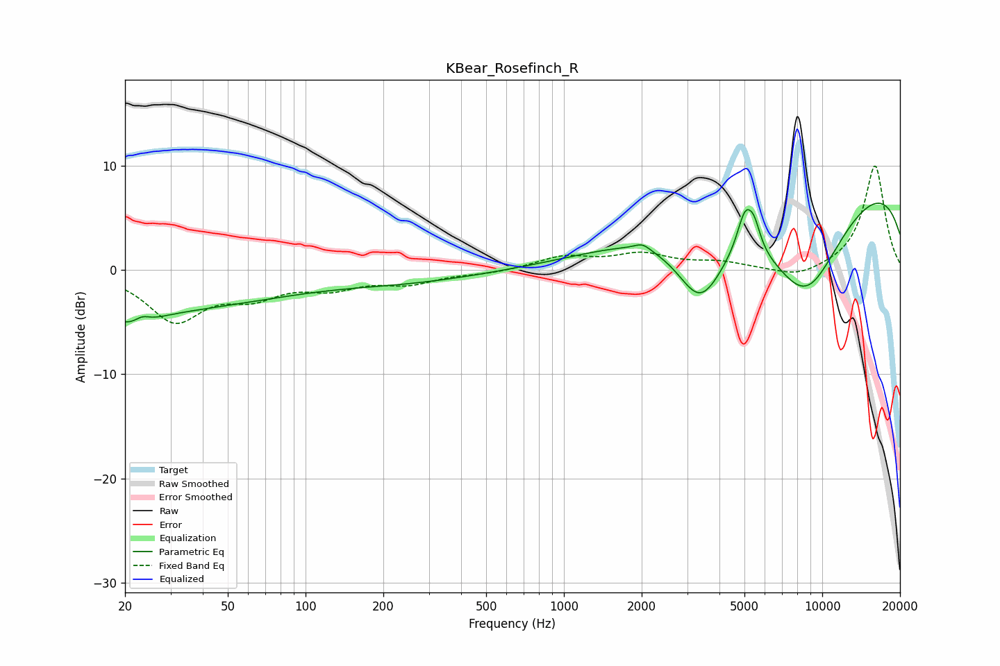

# KBear_Rosefinch_R
See [usage instructions](https://github.com/jaakkopasanen/AutoEq#usage) for more options and info.

### Parametric EQs
Apply preamp of -6.5 dB when using parametric equalizer.

|   # | Type    |   Fc (Hz) |    Q |   Gain (dB) |
|-----|---------|-----------|------|-------------|
|   1 | Peaking |        20 | 0.22 |        -3.8 |
|   2 | Peaking |        22 | 1.72 |        -1.4 |
|   3 | Peaking |        23 | 4.77 |         0.7 |
|   4 | Peaking |       249 | 0.49 |        -1   |
|   5 | Peaking |      2016 | 4.71 |         0.6 |
|   6 | Peaking |      3375 | 1.46 |        -7.2 |
|   7 | Peaking |      5030 | 4.36 |         4   |
|   8 | Peaking |      5458 | 5.62 |         2   |
|   9 | Peaking |      8604 | 0.76 |       -11.4 |
|  10 | Peaking |     10000 | 0.18 |        10.4 |

### Fixed Band EQs
When using fixed band (also called graphic) equalizer, apply preamp of **-10.1 dB** (if available) and set gains manually with these parameters.

|   # | Type    |   Fc (Hz) |    Q |   Gain (dB) |
|-----|---------|-----------|------|-------------|
|   1 | Peaking |        31 | 1.41 |        -4.7 |
|   2 | Peaking |        62 | 1.41 |        -2.1 |
|   3 | Peaking |       125 | 1.41 |        -1.4 |
|   4 | Peaking |       250 | 1.41 |        -1.1 |
|   5 | Peaking |       500 | 1.41 |        -0.3 |
|   6 | Peaking |      1000 | 1.41 |         1.2 |
|   7 | Peaking |      2000 | 1.41 |         1.4 |
|   8 | Peaking |      4000 | 1.41 |         0.6 |
|   9 | Peaking |      8000 | 1.41 |        -0.9 |
|  10 | Peaking |     16000 | 1.41 |        10.1 |

### Graphs

