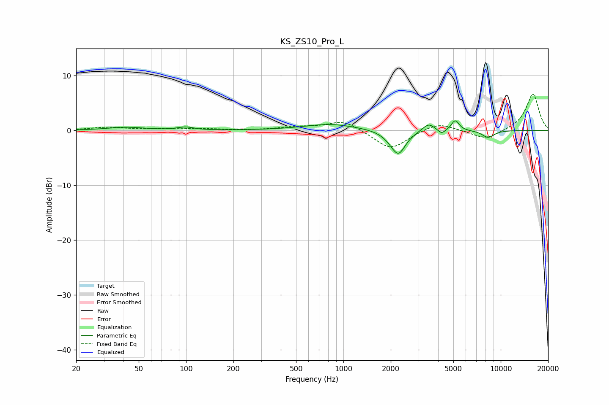

# KS_ZS10_Pro_L
See [usage instructions](https://github.com/jaakkopasanen/AutoEq#usage) for more options and info.

### Parametric EQs
Apply preamp of -1.9 dB when using parametric equalizer.

|   # | Type    |   Fc (Hz) |    Q |   Gain (dB) |
|-----|---------|-----------|------|-------------|
|   1 | Peaking |        41 | 1.25 |         0.6 |
|   2 | Peaking |        99 | 2.91 |         0.5 |
|   3 | Peaking |       830 | 0.85 |         1.2 |
|   4 | Peaking |      1992 | 2.48 |        -0.5 |
|   5 | Peaking |      2235 | 3.07 |        -4.1 |
|   6 | Peaking |      3477 | 3.65 |         1.5 |
|   7 | Peaking |      4211 | 6    |        -0.9 |
|   8 | Peaking |      5138 | 5.73 |         1.9 |
|   9 | Peaking |      7953 | 3.75 |        -0.1 |
|  10 | Peaking |      8327 | 3.42 |        -1.2 |

### Fixed Band EQs
When using fixed band (also called graphic) equalizer, apply preamp of **-6.7 dB** (if available) and set gains manually with these parameters.

|   # | Type    |   Fc (Hz) |    Q |   Gain (dB) |
|-----|---------|-----------|------|-------------|
|   1 | Peaking |        31 | 1.41 |         0.5 |
|   2 | Peaking |        62 | 1.41 |         0.2 |
|   3 | Peaking |       125 | 1.41 |         0.3 |
|   4 | Peaking |       250 | 1.41 |         0   |
|   5 | Peaking |       500 | 1.41 |         0.5 |
|   6 | Peaking |      1000 | 1.41 |         1.9 |
|   7 | Peaking |      2000 | 1.41 |        -3.6 |
|   8 | Peaking |      4000 | 1.41 |         1.6 |
|   9 | Peaking |      8000 | 1.41 |        -1.7 |
|  10 | Peaking |     16000 | 1.41 |         6.7 |

### Graphs

