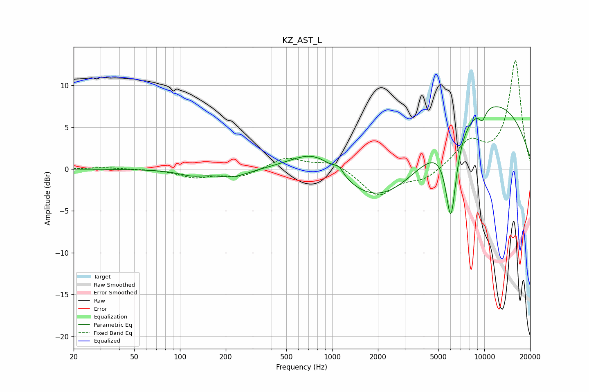

# KZ_AST_L
See [usage instructions](https://github.com/jaakkopasanen/AutoEq#usage) for more options and info.

### Parametric EQs
Apply preamp of -7.5 dB when using parametric equalizer.

|   # | Type    |   Fc (Hz) |    Q |   Gain (dB) |
|-----|---------|-----------|------|-------------|
|   1 | Peaking |        95 | 1.19 |        -0.1 |
|   2 | Peaking |       121 | 1.72 |        -0.6 |
|   3 | Peaking |       220 | 1.29 |        -1   |
|   4 | Peaking |       788 | 0.84 |         3.6 |
|   5 | Peaking |      1109 | 5.01 |         0.9 |
|   6 | Peaking |      2158 | 0.47 |        -5.9 |
|   7 | Peaking |      6033 | 3.83 |       -10.2 |
|   8 | Peaking |      9654 | 5.59 |        -1   |
|   9 | Peaking |      9899 | 5.46 |        -0.4 |
|  10 | Peaking |      9961 | 0.3  |         8.5 |

### Fixed Band EQs
When using fixed band (also called graphic) equalizer, apply preamp of **-13.1 dB** (if available) and set gains manually with these parameters.

|   # | Type    |   Fc (Hz) |    Q |   Gain (dB) |
|-----|---------|-----------|------|-------------|
|   1 | Peaking |        31 | 1.41 |         0.2 |
|   2 | Peaking |        62 | 1.41 |         0   |
|   3 | Peaking |       125 | 1.41 |        -0.9 |
|   4 | Peaking |       250 | 1.41 |        -0.9 |
|   5 | Peaking |       500 | 1.41 |         1.4 |
|   6 | Peaking |      1000 | 1.41 |         1   |
|   7 | Peaking |      2000 | 1.41 |        -3.2 |
|   8 | Peaking |      4000 | 1.41 |        -1.2 |
|   9 | Peaking |      8000 | 1.41 |         3   |
|  10 | Peaking |     16000 | 1.41 |        12.9 |

### Graphs

