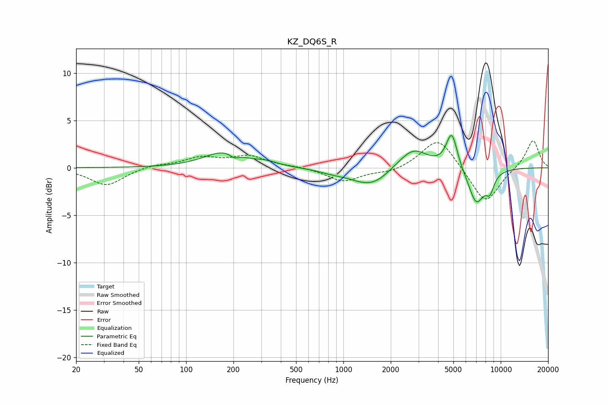

# KZ_DQ6S_R
See [usage instructions](https://github.com/jaakkopasanen/AutoEq#usage) for more options and info.

### Parametric EQs
Apply preamp of -3.5 dB when using parametric equalizer.

|   # | Type    |   Fc (Hz) |    Q |   Gain (dB) |
|-----|---------|-----------|------|-------------|
|   1 | Peaking |       175 | 1.13 |         1.7 |
|   2 | Peaking |       202 | 4.96 |        -0.5 |
|   3 | Peaking |       325 | 2.13 |         0.4 |
|   4 | Peaking |       847 | 1.62 |        -0.3 |
|   5 | Peaking |      1398 | 1.22 |        -1.5 |
|   6 | Peaking |      1676 | 1.94 |        -0.5 |
|   7 | Peaking |      2777 | 1.55 |         2.1 |
|   8 | Peaking |      4883 | 3.95 |         3.8 |
|   9 | Peaking |      6990 | 2.62 |        -3.7 |
|  10 | Peaking |      8539 | 4.78 |        -1.7 |

### Fixed Band EQs
When using fixed band (also called graphic) equalizer, apply preamp of **-2.9 dB** (if available) and set gains manually with these parameters.

|   # | Type    |   Fc (Hz) |    Q |   Gain (dB) |
|-----|---------|-----------|------|-------------|
|   1 | Peaking |        31 | 1.41 |        -1.9 |
|   2 | Peaking |        62 | 1.41 |         0.3 |
|   3 | Peaking |       125 | 1.41 |         1   |
|   4 | Peaking |       250 | 1.41 |         1.2 |
|   5 | Peaking |       500 | 1.41 |         0.1 |
|   6 | Peaking |      1000 | 1.41 |        -1.4 |
|   7 | Peaking |      2000 | 1.41 |        -0.5 |
|   8 | Peaking |      4000 | 1.41 |         3.3 |
|   9 | Peaking |      8000 | 1.41 |        -3.9 |
|  10 | Peaking |     16000 | 1.41 |         3   |

### Graphs

