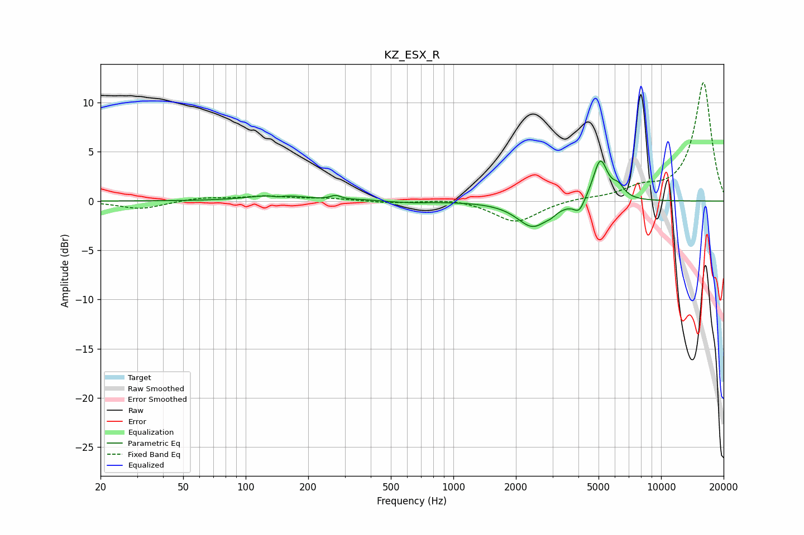

# KZ_ESX_R
See [usage instructions](https://github.com/jaakkopasanen/AutoEq#usage) for more options and info.

### Parametric EQs
Apply preamp of -4.2 dB when using parametric equalizer.

|   # | Type    |   Fc (Hz) |    Q |   Gain (dB) |
|-----|---------|-----------|------|-------------|
|   1 | Peaking |       141 | 1.21 |         0.6 |
|   2 | Peaking |       142 | 5.38 |        -0.2 |
|   3 | Peaking |       271 | 5.62 |         0.4 |
|   4 | Peaking |       361 | 2.52 |         0.1 |
|   5 | Peaking |       625 | 1.57 |        -0.2 |
|   6 | Peaking |      2415 | 1.87 |        -2.6 |
|   7 | Peaking |      2953 | 6    |        -0.3 |
|   8 | Peaking |      4037 | 5.39 |        -1.3 |
|   9 | Peaking |      5097 | 3.95 |         4.3 |
|  10 | Peaking |      6231 | 4.72 |         1.1 |

### Fixed Band EQs
When using fixed band (also called graphic) equalizer, apply preamp of **-12.1 dB** (if available) and set gains manually with these parameters.

|   # | Type    |   Fc (Hz) |    Q |   Gain (dB) |
|-----|---------|-----------|------|-------------|
|   1 | Peaking |        31 | 1.41 |        -0.8 |
|   2 | Peaking |        62 | 1.41 |         0.4 |
|   3 | Peaking |       125 | 1.41 |         0.4 |
|   4 | Peaking |       250 | 1.41 |         0.2 |
|   5 | Peaking |       500 | 1.41 |        -0.2 |
|   6 | Peaking |      1000 | 1.41 |         0.3 |
|   7 | Peaking |      2000 | 1.41 |        -2.2 |
|   8 | Peaking |      4000 | 1.41 |         0.2 |
|   9 | Peaking |      8000 | 1.41 |         1.1 |
|  10 | Peaking |     16000 | 1.41 |        12.1 |

### Graphs

