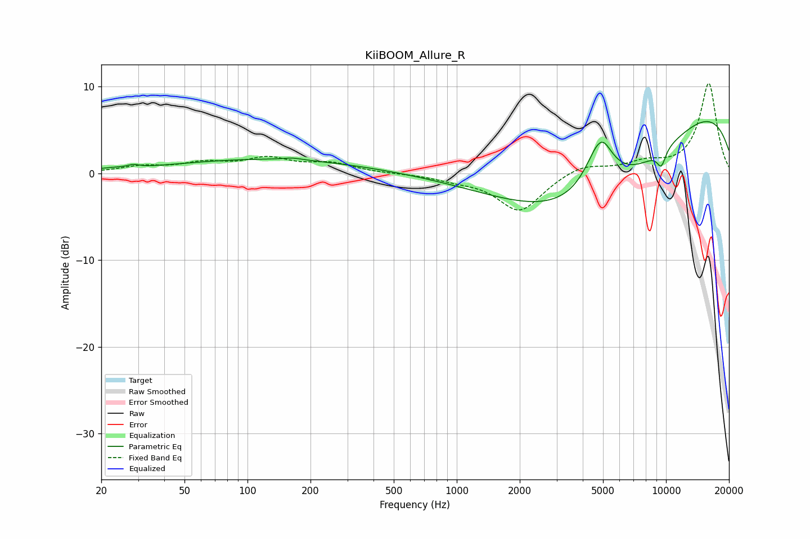

# KiiBOOM_Allure_R
See [usage instructions](https://github.com/jaakkopasanen/AutoEq#usage) for more options and info.

### Parametric EQs
Apply preamp of -6.1 dB when using parametric equalizer.

|   # | Type    |   Fc (Hz) |    Q |   Gain (dB) |
|-----|---------|-----------|------|-------------|
|   1 | Peaking |        22 | 1.75 |         0.2 |
|   2 | Peaking |        28 | 5.44 |         0.3 |
|   3 | Peaking |       126 | 0.31 |         1.6 |
|   4 | Peaking |       164 | 3.26 |         0.2 |
|   5 | Peaking |      4234 | 0.37 |        -4.6 |
|   6 | Peaking |      4822 | 2.02 |         6   |
|   7 | Peaking |      4857 | 0.31 |        -7.9 |
|   8 | Peaking |      5033 | 4.77 |         0.4 |
|   9 | Peaking |      9219 | 0.21 |        11   |
|  10 | Peaking |      9499 | 5.95 |        -1.9 |

### Fixed Band EQs
When using fixed band (also called graphic) equalizer, apply preamp of **-10.5 dB** (if available) and set gains manually with these parameters.

|   # | Type    |   Fc (Hz) |    Q |   Gain (dB) |
|-----|---------|-----------|------|-------------|
|   1 | Peaking |        31 | 1.41 |         0.7 |
|   2 | Peaking |        62 | 1.41 |         1   |
|   3 | Peaking |       125 | 1.41 |         1.6 |
|   4 | Peaking |       250 | 1.41 |         1   |
|   5 | Peaking |       500 | 1.41 |        -0   |
|   6 | Peaking |      1000 | 1.41 |        -0.6 |
|   7 | Peaking |      2000 | 1.41 |        -4.4 |
|   8 | Peaking |      4000 | 1.41 |         1.1 |
|   9 | Peaking |      8000 | 1.41 |         1.1 |
|  10 | Peaking |     16000 | 1.41 |        10.4 |

### Graphs

