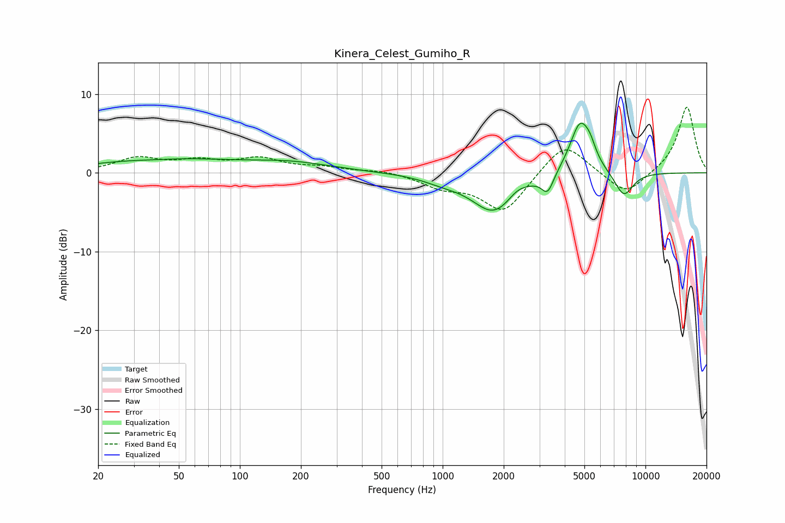

# Kinera_Celest_Gumiho_R
See [usage instructions](https://github.com/jaakkopasanen/AutoEq#usage) for more options and info.

### Parametric EQs
Apply preamp of -6.4 dB when using parametric equalizer.

|   # | Type    |   Fc (Hz) |    Q |   Gain (dB) |
|-----|---------|-----------|------|-------------|
|   1 | Peaking |        38 | 1.1  |        -0.3 |
|   2 | Peaking |        42 | 0.43 |         1.8 |
|   3 | Peaking |       178 | 0.68 |         1.1 |
|   4 | Peaking |      1002 | 1.4  |        -0.7 |
|   5 | Peaking |      1783 | 1.32 |        -4.9 |
|   6 | Peaking |      2336 | 3.15 |         0.7 |
|   7 | Peaking |      3294 | 4.71 |        -2.4 |
|   8 | Peaking |      4763 | 2.68 |         6.6 |
|   9 | Peaking |      5342 | 5.16 |         1.3 |
|  10 | Peaking |      7824 | 2.87 |        -3.2 |

### Fixed Band EQs
When using fixed band (also called graphic) equalizer, apply preamp of **-8.4 dB** (if available) and set gains manually with these parameters.

|   # | Type    |   Fc (Hz) |    Q |   Gain (dB) |
|-----|---------|-----------|------|-------------|
|   1 | Peaking |        31 | 1.41 |         1.8 |
|   2 | Peaking |        62 | 1.41 |         1.3 |
|   3 | Peaking |       125 | 1.41 |         1.6 |
|   4 | Peaking |       250 | 1.41 |         0.6 |
|   5 | Peaking |       500 | 1.41 |         0.4 |
|   6 | Peaking |      1000 | 1.41 |        -1.6 |
|   7 | Peaking |      2000 | 1.41 |        -5   |
|   8 | Peaking |      4000 | 1.41 |         4.2 |
|   9 | Peaking |      8000 | 1.41 |        -3   |
|  10 | Peaking |     16000 | 1.41 |         8.5 |

### Graphs

