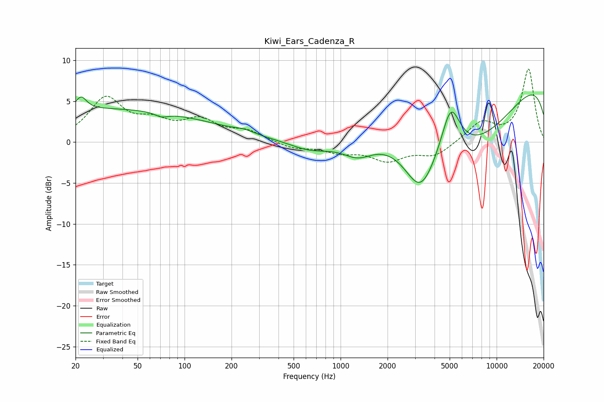

# Kiwi_Ears_Cadenza_R
See [usage instructions](https://github.com/jaakkopasanen/AutoEq#usage) for more options and info.

### Parametric EQs
Apply preamp of -5.9 dB when using parametric equalizer.

|   # | Type    |   Fc (Hz) |    Q |   Gain (dB) |
|-----|---------|-----------|------|-------------|
|   1 | Peaking |        22 | 4.24 |         1.6 |
|   2 | Peaking |        31 | 0.18 |         4   |
|   3 | Peaking |        71 | 3.34 |        -0.5 |
|   4 | Peaking |       241 | 2.18 |         0.4 |
|   5 | Peaking |       641 | 1.07 |        -1.2 |
|   6 | Peaking |      1290 | 1.41 |        -2   |
|   7 | Peaking |      3252 | 1.36 |        -6.5 |
|   8 | Peaking |      5082 | 2.32 |         5.9 |
|   9 | Peaking |      6871 | 0.37 |       -10   |
|  10 | Peaking |     10000 | 0.18 |        10.8 |

### Fixed Band EQs
When using fixed band (also called graphic) equalizer, apply preamp of **-9.0 dB** (if available) and set gains manually with these parameters.

|   # | Type    |   Fc (Hz) |    Q |   Gain (dB) |
|-----|---------|-----------|------|-------------|
|   1 | Peaking |        31 | 1.41 |         5.2 |
|   2 | Peaking |        62 | 1.41 |         2   |
|   3 | Peaking |       125 | 1.41 |         2.4 |
|   4 | Peaking |       250 | 1.41 |         1.2 |
|   5 | Peaking |       500 | 1.41 |        -0.8 |
|   6 | Peaking |      1000 | 1.41 |        -1.1 |
|   7 | Peaking |      2000 | 1.41 |        -2.1 |
|   8 | Peaking |      4000 | 1.41 |        -1.6 |
|   9 | Peaking |      8000 | 1.41 |         2.4 |
|  10 | Peaking |     16000 | 1.41 |         8.9 |

### Graphs

