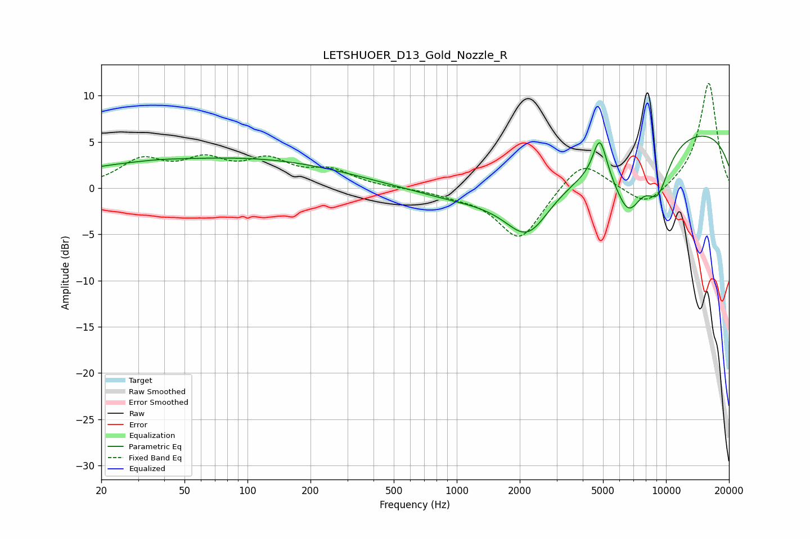

# LETSHUOER_D13_Gold_Nozzle_R
See [usage instructions](https://github.com/jaakkopasanen/AutoEq#usage) for more options and info.

### Parametric EQs
Apply preamp of -5.7 dB when using parametric equalizer.

|   # | Type    |   Fc (Hz) |    Q |   Gain (dB) |
|-----|---------|-----------|------|-------------|
|   1 | Peaking |        20 | 1    |         0.1 |
|   2 | Peaking |        37 | 1.82 |         0.1 |
|   3 | Peaking |        56 | 0.24 |         2.9 |
|   4 | Peaking |       292 | 0.32 |         0.9 |
|   5 | Peaking |      2181 | 1.33 |        -5.1 |
|   6 | Peaking |      2501 | 0.26 |        -3.3 |
|   7 | Peaking |      4826 | 4.23 |         4.5 |
|   8 | Peaking |      6618 | 1.97 |        -5.7 |
|   9 | Peaking |      9137 | 2.28 |        -4.6 |
|  10 | Peaking |     10000 | 0.19 |         7.1 |

### Fixed Band EQs
When using fixed band (also called graphic) equalizer, apply preamp of **-11.4 dB** (if available) and set gains manually with these parameters.

|   # | Type    |   Fc (Hz) |    Q |   Gain (dB) |
|-----|---------|-----------|------|-------------|
|   1 | Peaking |        31 | 1.41 |         2.8 |
|   2 | Peaking |        62 | 1.41 |         2.6 |
|   3 | Peaking |       125 | 1.41 |         2.6 |
|   4 | Peaking |       250 | 1.41 |         1.7 |
|   5 | Peaking |       500 | 1.41 |        -0   |
|   6 | Peaking |      1000 | 1.41 |        -0.5 |
|   7 | Peaking |      2000 | 1.41 |        -5.7 |
|   8 | Peaking |      4000 | 1.41 |         3.3 |
|   9 | Peaking |      8000 | 1.41 |        -2.2 |
|  10 | Peaking |     16000 | 1.41 |        11.5 |

### Graphs

