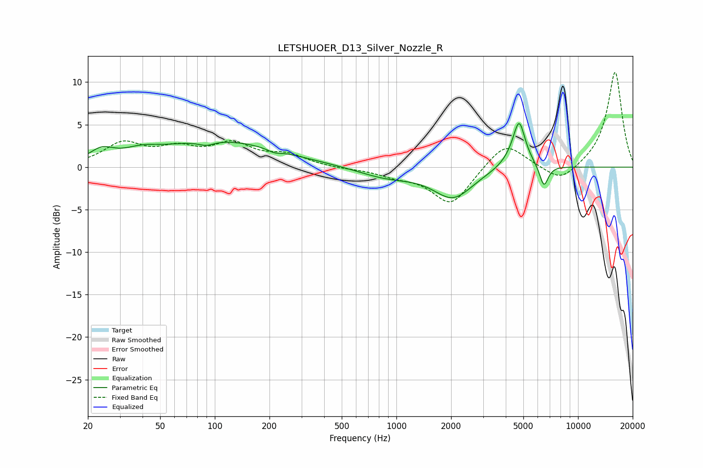

# LETSHUOER_D13_Silver_Nozzle_R
See [usage instructions](https://github.com/jaakkopasanen/AutoEq#usage) for more options and info.

### Parametric EQs
Apply preamp of -5.2 dB when using parametric equalizer.

|   # | Type    |   Fc (Hz) |    Q |   Gain (dB) |
|-----|---------|-----------|------|-------------|
|   1 | Peaking |        24 | 2.22 |         1.4 |
|   2 | Peaking |        39 | 1.57 |         0.8 |
|   3 | Peaking |        90 | 3.24 |        -0.5 |
|   4 | Peaking |       105 | 0.42 |         3.1 |
|   5 | Peaking |       213 | 4.06 |        -0.4 |
|   6 | Peaking |       883 | 0.89 |        -1.2 |
|   7 | Peaking |      2051 | 1.31 |        -3.5 |
|   8 | Peaking |      4585 | 2.09 |         1.6 |
|   9 | Peaking |      4742 | 4.51 |         4.2 |
|  10 | Peaking |      6487 | 5.67 |        -2.6 |

### Fixed Band EQs
When using fixed band (also called graphic) equalizer, apply preamp of **-11.2 dB** (if available) and set gains manually with these parameters.

|   # | Type    |   Fc (Hz) |    Q |   Gain (dB) |
|-----|---------|-----------|------|-------------|
|   1 | Peaking |        31 | 1.41 |         2.6 |
|   2 | Peaking |        62 | 1.41 |         1.8 |
|   3 | Peaking |       125 | 1.41 |         2.5 |
|   4 | Peaking |       250 | 1.41 |         1.3 |
|   5 | Peaking |       500 | 1.41 |        -0.2 |
|   6 | Peaking |      1000 | 1.41 |        -0.8 |
|   7 | Peaking |      2000 | 1.41 |        -4.4 |
|   8 | Peaking |      4000 | 1.41 |         3.1 |
|   9 | Peaking |      8000 | 1.41 |        -2   |
|  10 | Peaking |     16000 | 1.41 |        11.3 |

### Graphs

