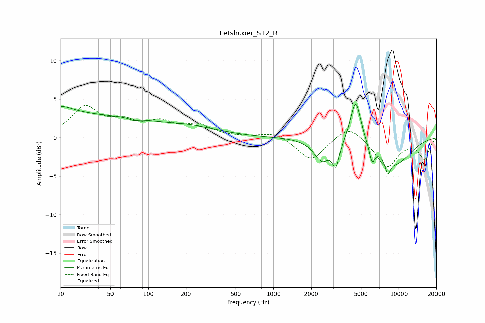

# Letshuoer_S12_R
See [usage instructions](https://github.com/jaakkopasanen/AutoEq#usage) for more options and info.

### Parametric EQs
Apply preamp of -4.4 dB when using parametric equalizer.

|   # | Type    |   Fc (Hz) |    Q |   Gain (dB) |
|-----|---------|-----------|------|-------------|
|   1 | Peaking |        20 | 1.41 |         1.1 |
|   2 | Peaking |        23 | 0.19 |         2.9 |
|   3 | Peaking |        77 | 4.57 |        -0.3 |
|   4 | Peaking |       231 | 0.61 |         1   |
|   5 | Peaking |      2432 | 2.18 |        -2.8 |
|   6 | Peaking |      3155 | 5.17 |        -3   |
|   7 | Peaking |      4528 | 3.37 |         5.7 |
|   8 | Peaking |      6123 | 6    |        -2.2 |
|   9 | Peaking |      8167 | 5.84 |        -1.9 |
|  10 | Peaking |      9483 | 0.92 |        -3.3 |

### Fixed Band EQs
When using fixed band (also called graphic) equalizer, apply preamp of **-4.3 dB** (if available) and set gains manually with these parameters.

|   # | Type    |   Fc (Hz) |    Q |   Gain (dB) |
|-----|---------|-----------|------|-------------|
|   1 | Peaking |        31 | 1.41 |         3.8 |
|   2 | Peaking |        62 | 1.41 |         1.7 |
|   3 | Peaking |       125 | 1.41 |         1.7 |
|   4 | Peaking |       250 | 1.41 |         1.4 |
|   5 | Peaking |       500 | 1.41 |         0.1 |
|   6 | Peaking |      1000 | 1.41 |         0.8 |
|   7 | Peaking |      2000 | 1.41 |        -3   |
|   8 | Peaking |      4000 | 1.41 |         1.9 |
|   9 | Peaking |      8000 | 1.41 |        -3.8 |
|  10 | Peaking |     16000 | 1.41 |        -2.7 |

### Graphs

