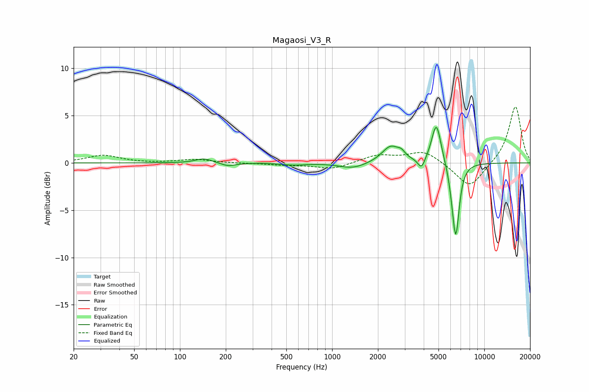

# Magaosi_V3_R
See [usage instructions](https://github.com/jaakkopasanen/AutoEq#usage) for more options and info.

### Parametric EQs
Apply preamp of -3.9 dB when using parametric equalizer.

|   # | Type    |   Fc (Hz) |    Q |   Gain (dB) |
|-----|---------|-----------|------|-------------|
|   1 | Peaking |       144 | 2.69 |         0.5 |
|   2 | Peaking |       208 | 3.04 |        -0.4 |
|   3 | Peaking |       561 | 1.97 |        -0.2 |
|   4 | Peaking |      1370 | 1.6  |        -0.6 |
|   5 | Peaking |      2429 | 2.43 |         1.8 |
|   6 | Peaking |      2852 | 6    |         0.5 |
|   7 | Peaking |      3866 | 6    |        -1.2 |
|   8 | Peaking |      4842 | 4.45 |         4.3 |
|   9 | Peaking |      6175 | 6    |        -1   |
|  10 | Peaking |      6505 | 6    |        -7.4 |

### Fixed Band EQs
When using fixed band (also called graphic) equalizer, apply preamp of **-6.0 dB** (if available) and set gains manually with these parameters.

|   # | Type    |   Fc (Hz) |    Q |   Gain (dB) |
|-----|---------|-----------|------|-------------|
|   1 | Peaking |        31 | 1.41 |         0.8 |
|   2 | Peaking |        62 | 1.41 |        -0   |
|   3 | Peaking |       125 | 1.41 |         0.4 |
|   4 | Peaking |       250 | 1.41 |        -0   |
|   5 | Peaking |       500 | 1.41 |        -0.2 |
|   6 | Peaking |      1000 | 1.41 |        -0.7 |
|   7 | Peaking |      2000 | 1.41 |         0.8 |
|   8 | Peaking |      4000 | 1.41 |         1.3 |
|   9 | Peaking |      8000 | 1.41 |        -2.7 |
|  10 | Peaking |     16000 | 1.41 |         6.1 |

### Graphs

